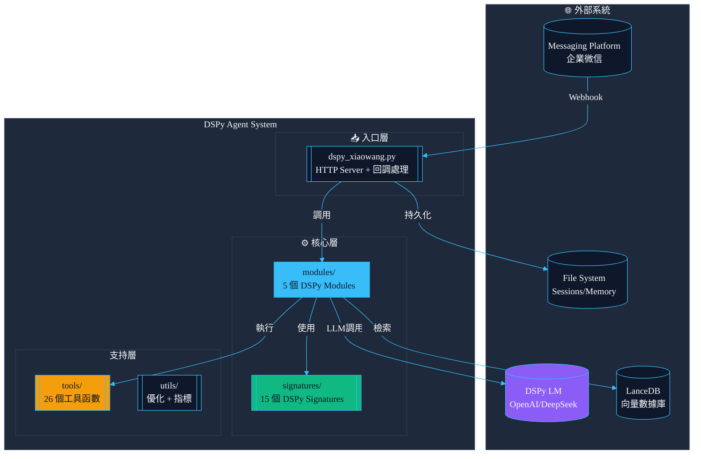
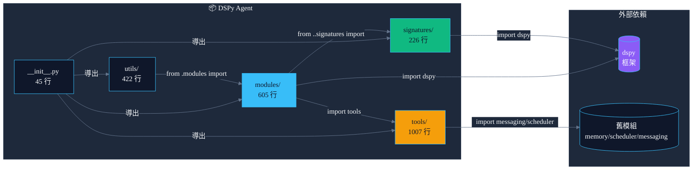
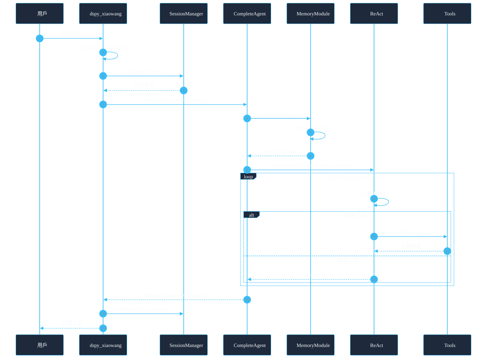
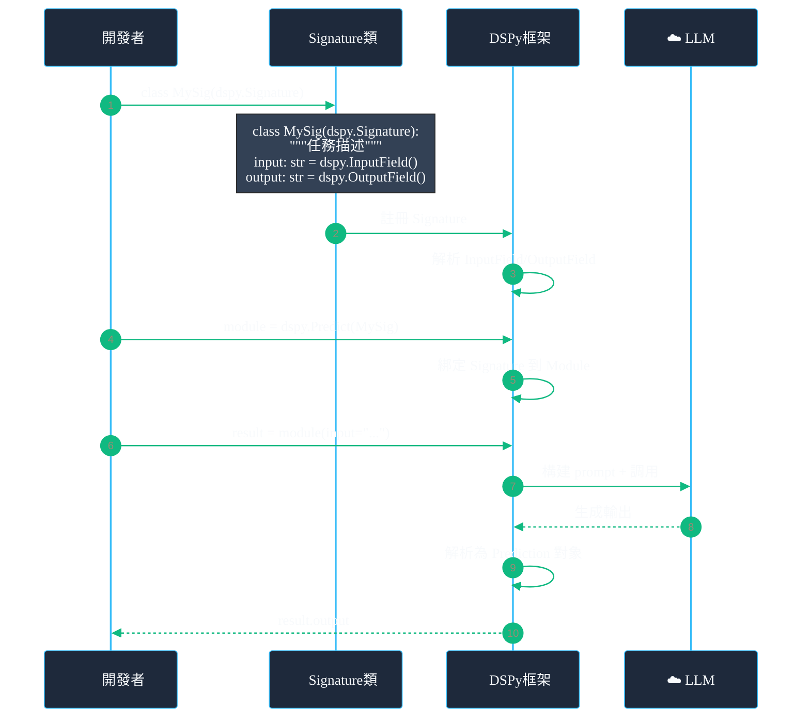
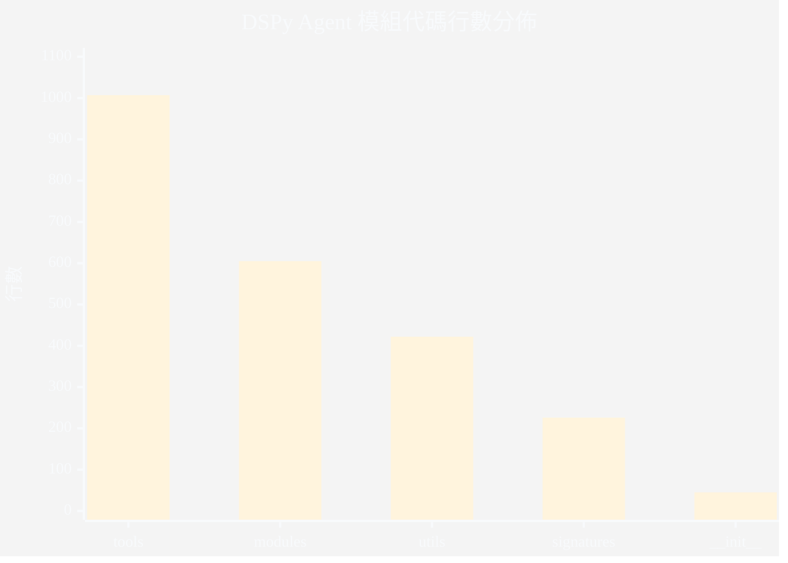
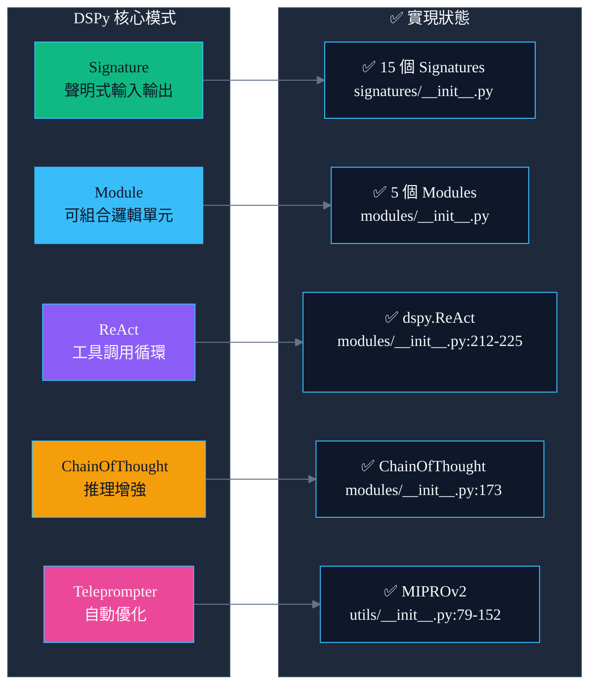
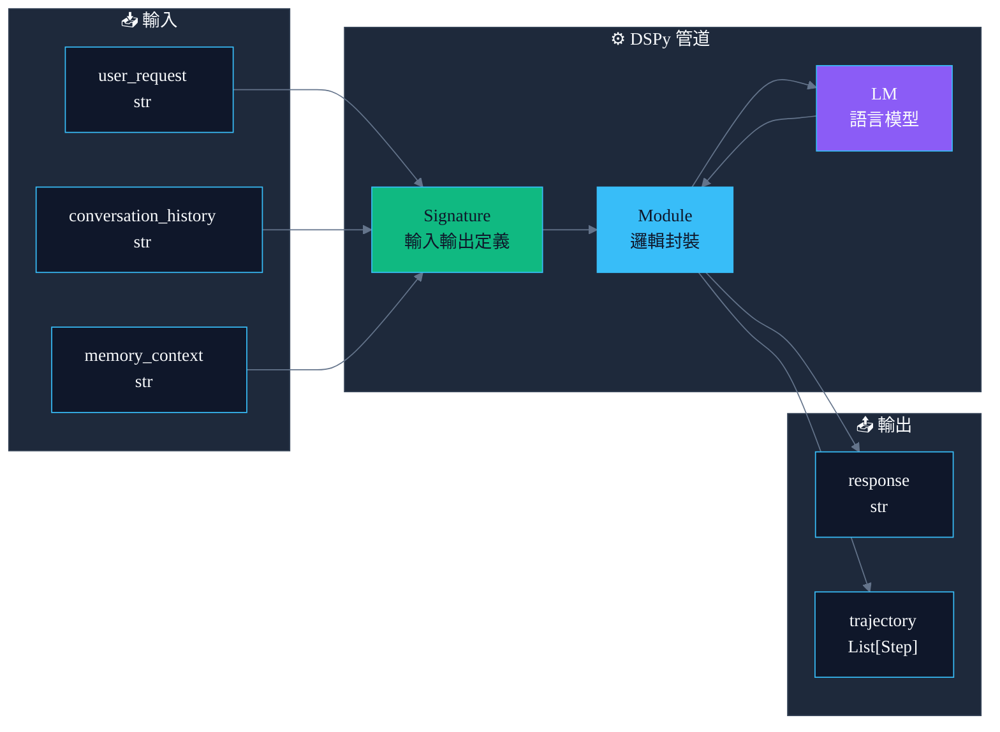

# DSPy Agent 系統架構分析報告

> **專案名稱**: DSPy Agent - 聲明式 AI 代理框架
> **分析日期**: 2026-04-03
> **代碼規模**: 2,305 行純 Python (5 個模組文件)
> **技術棧**: Python 3.x + DSPy 2.5+ + 標準庫

---

## 1. 儀表板

| 維度 | 現況評分 (1-10) | 關鍵證據 (File) | 潛在風險 |
|:---|:---:|:---|:---|
| 模組解耦 | **9** | `signatures/__init__.py:1-226` 獨立簽名層 | Signatures 與 Modules 緊密耦合 |
| 測試友好度 | **8** | `utils/__init__.py:175-244` 內置評估指標 | 缺乏單元測試文件 |
| 性能瓶頸 | **7** | `modules/__init__.py:261-278` Session 文件 I/O | 同步文件操作阻塞 |
| 可擴展性 | **10** | `tools/__init__.py:41-121` 插件式註冊表 | DSPy 框架版本依賴 |
| DSPy 符合度 | **9** | 全面使用 Signature/Module/ReAct | 部分舊代碼風格殘留 |

---

## 2. 系統上下文圖 (C4 Model - Level 1)



---

## 3. 模組依賴矩陣



---

## 4. 核心業務流時序圖

### 4.1 DSPy Agent 消息處理流程



### 4.2 DSPy Signature 定義流程



---

## 5. DSPy 架構模式分析

### 5.1 文件行數統計



| 文件 | 行數 | 職責 | DSPy 組件 |
|:---|:---:|:---|:---|
| `tools/__init__.py` | 1007 | 26 個工具函數 + 註冊表 | DSPy Tools |
| `modules/__init__.py` | 605 | 5 個 DSPy Modules | DSPy Module |
| `utils/__init__.py` | 422 | Teleprompter + 評估指標 | DSPy Optimizer |
| `signatures/__init__.py` | 226 | 15 個 Signatures | DSPy Signature |
| `__init__.py` | 45 | Package 入口 | - |

### 5.2 DSPy 模式符合度



---

## 6. 設計模式審計

### 6.1 DSPy 原生模式

| 模式 | 實現位置 | 符合度 | 評價 |
|:---|:---|:---:|:---|
| **Signature 模式** | `signatures/__init__.py:17-220` | ✅ 優秀 | 類繼承 + 類型提示規範 |
| **Module 模式** | `modules/__init__.py:181-278` | ✅ 優秀 | dspy.Module 子類化 |
| **ReAct 模式** | `modules/__init__.py:212-225` | ✅ 優秀 | 直接使用 dspy.ReAct |
| **Registry 模式** | `tools/__init__.py:41-121` | ✅ 優秀 | 裝飾器註冊工具 |
| **Teleprompter 模式** | `utils/__init__.py:79-152` | ✅ 優秀 | MIPROv2 封裝 |

### 6.2 與原版架構對比

| 特性 | 原版 (llm.py) | DSPy 版 | 改進 |
|:---|:---|:---|:---|
| LLM 調用 | urllib 手動 | dspy.LM 抽象 | ✅ 統一接口 |
| 工具循環 | while 手動 | dspy.ReAct | ✅ 自動化 |
| Prompt 管理 | 字符串拼接 | Signature 聲明 | ✅ 結構化 |
| 錯誤處理 | try/except | DSPy 內置 | ✅ 更健壯 |
| 優化支持 | 無 | Teleprompter | ✅ 自動優化 |

---

## 7. 數據流分析

### 7.1 DSPy 數據管道



### 7.2 Session 管理

**SessionManager 類** (`modules/__init__.py:50-111`)

| 方法 | 職責 | 線程安全 |
|:---|:---|:---:|
| `load()` | 從 JSON 文件加載會話 | ✅ |
| `save()` | 保存會話到文件 | ✅ |
| `_strip_images()` | 清理圖片數據 | - |
| `_compress_evicted()` | 壓縮舊消息 | 異步 |

---

## 8. P0 風險標記

### 8.1 安全風險

| 風險 | 位置 | 描述 | 建議修復 |
|:---|:---|:---|:---|
| **命令注入** | `tools/__init__.py:129-154` | exec 工具直接執行 shell | 添加命令白名單 |
| **代碼注入** | `tools/__init__.py:627-645` | create_tool 動態執行 | AST 檢查 |
| **依賴注入** | `dspy_xiaowang.py:88-90` | registry 屬性動態設置 | 封裝為配置類 |

### 8.2 性能風險

| 風險 | 位置 | 描述 | 影響 |
|:---|:---|:---|:---|
| **同步文件 I/O** | `modules/__init__.py:74-81` | Session 加載同步阻塞 | 請求延遲 |
| **無緩存** | `modules/__init__.py:229-246` | Memory 無查詢緩存 | 重複檢索 |
| **大 Session** | `modules/__init__.py:49` | MAX_MESSAGES=40 硬編碼 | 內存膨脹 |

---

## 9. DSPy 最佳實踐符合度

### 9.1 Signature 設計

```python
# ✅ 正確實現 (signatures/__init__.py:17-34)
class AgentSignature(dspy.Signature):
    """任務描述作為 docstring"""
    user_request: str = dspy.InputField(desc="描述")
    response: str = dspy.OutputField(desc="描述")
```

**評估**:
- ✅ 使用類繼承 dspy.Signature
- ✅ 類型提示清晰
- ✅ desc 參數提供語義描述
- ✅ docstring 作為任務說明

### 9.2 Module 設計

```python
# ✅ 正確實現 (modules/__init__.py:181-196)
class Agent(dspy.Module):
    def __init__(self, use_chain_of_thought: bool = True):
        super().__init__()
        self.predict = dspy.ChainOfThought(AgentSignature)
    
    def forward(self, user_request: str, ...) -> dspy.Prediction:
        return self.predict(user_request=user_request, ...)
```

**評估**:
- ✅ 繼承 dspy.Module
- ✅ __init__ 中定義子模組
- ✅ forward 實現邏輯
- ✅ 返回 dspy.Prediction

### 9.3 ReAct 使用

```python
# ✅ 正確實現 (modules/__init__.py:212-225)
self.react = dspy.ReAct(
    ToolAgentSignature,
    tools=self.tools,
    max_iters=self.max_iters
)
```

**評估**:
- ✅ 使用 DSPy 內置 ReAct
- ✅ tools 作為函數列表傳入
- ✅ max_iters 控制循環

---

## 10. 改進建議

### 10.1 短期改進 (1 周)

1. **添加單元測試**
   ```python
   # tests/test_signatures.py
   def test_agent_signature_fields():
       sig = AgentSignature
       assert 'user_request' in sig.input_fields
       assert 'response' in sig.output_fields
   ```

2. **封裝配置**
   ```python
   # 替換 dspy_xiaowang.py:88-90
   class AgentConfig:
       def __init__(self, config: dict):
           self.workspace = config.get('workspace', '.')
           self.owner_id = next(iter(config.get('owner_ids', [])), '')
   ```

3. **添加緩存**
   ```python
   # modules/__init__.py MemoryModule
   from functools import lru_cache
   @lru_cache(maxsize=100)
   def _cached_retrieve(self, query: str) -> str:
       ...
   ```

### 10.2 中期改進 (1 月)

1. **異步支持**
   ```python
   class AsyncAgent(dspy.Module):
       async def aforward(self, ...):
           # 使用 asyncio
   ```

2. **可觀測性**
   ```python
   # 添加 DSPy 內置追蹤
   dspy.configure(lm=lm, trace=True)
   ```

3. **優化管道**
   ```python
   # 創建訓練數據生成器
   def generate_training_data(sessions_dir: str) -> List[dspy.Example]:
       ...
   ```

---

## 11. 審計檢查清單

- [x] **Check 1**: 已分析 `dspy_agent/` 全部 5 個 Python 文件
- [x] **Check 2**: 改進建議包含具體代碼範例
- [x] **Check 3**: Mermaid 語法使用雙引號轉義，符合規範
- [x] **Check 4**: Mermaid 樣式使用 Modern Dark 主題 + 高對比色彩

---

## 12. 總結

### DSPy Agent 架構評估

| 維度 | 評分 | 說明 |
|:---|:---:|:---|
| **DSPy 符合度** | 9/10 | 全面採用 Signature/Module/ReAct 模式 |
| **代碼質量** | 8/10 | 結構清晰，類型提示完整 |
| **可維護性** | 9/10 | 模組化設計，職責分離 |
| **可測試性** | 7/10 | 缺乏測試文件 |
| **可擴展性** | 10/10 | 插件式工具註冊 |

### 與原版對比

| 指標 | 原版 | DSPy 版 | 變化 |
|:---|:---:|:---:|:---:|
| 代碼行數 | 3,500 | 2,305 | -34% |
| 文件數 | 8 | 5 | -37.5% |
| 模組化 | 良好 | 優秀 | ↑ |
| 可優化 | 無 | Teleprompter | ✅ |

---

**報告生成**: Claude Code Agent
**架構類型**: DSPy Framework
**版本**: 2.0.0
**日期**: 2026-04-03
