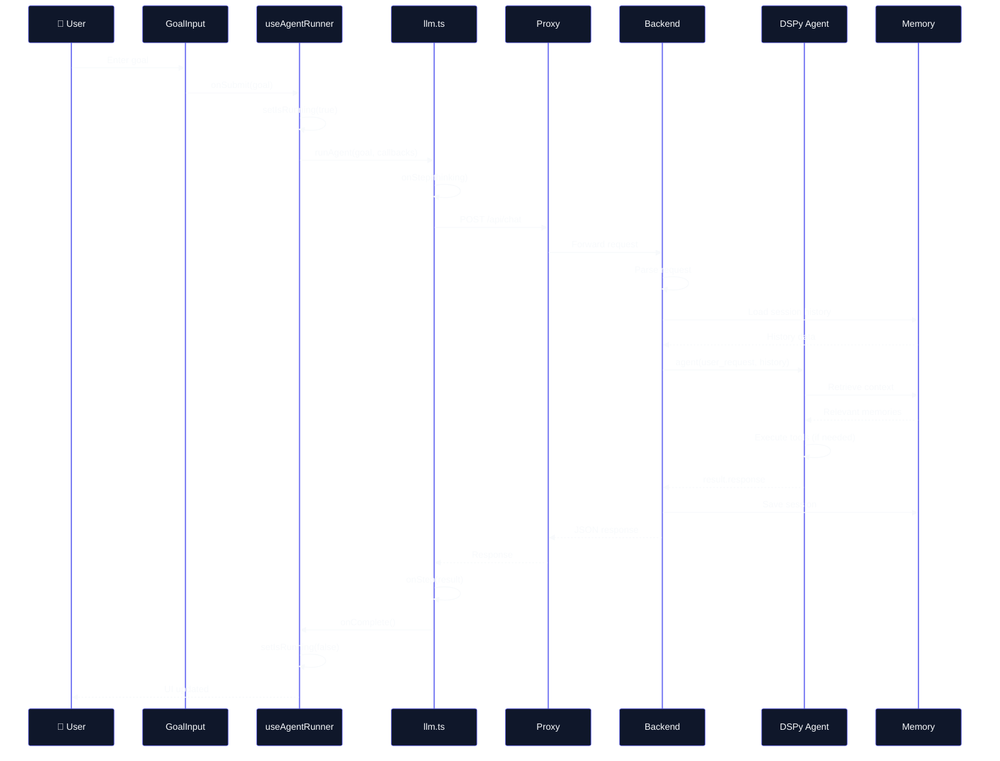
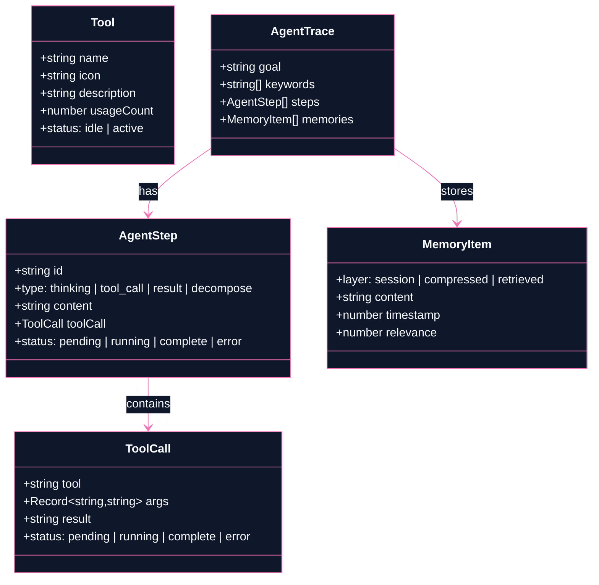
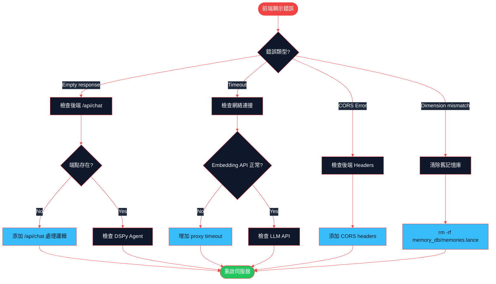
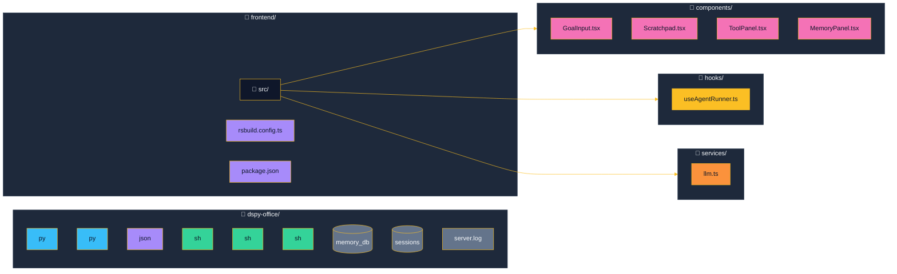
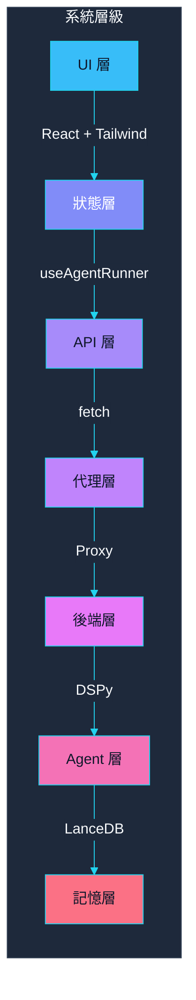

# Frontend-Backend 整合報告

## 概述

本文檔詳細說明 DSPy Office 前端 UI 如何與後端伺服器協作，實現 AI Agent 的即時互動介面。

---

## 系統架構

```mermaid
%%{init: {
  'theme': 'base',
  'themeVariables': {
    'primaryColor': '#1e293b',
    'primaryTextColor': '#f8fafc',
    'primaryBorderColor': '#38bdf8',
    'lineColor': '#38bdf8',
    'secondaryColor': '#0f172a',
    'tertiaryColor': '#1e293b',
    'mainBkg': '#0f172a',
    'nodeBorder': '#38bdf8',
    'clusterBkg': '#1e293b',
    'clusterBorder': '#334155',
    'titleColor': '#f8fafc',
    'edgeLabelBackground':'#1e293b',
    'defaultLinkColor': '#38bdf8'
  }
}}%%
graph TD
    subgraph Frontend["🖥️ Frontend (React - Port 3001)"]
        A[([GoalInput])] -->|用戶輸入| B[[useAgentRunner]]
        B -->|狀態管理| C[[llm.ts]]
        C -->|POST /api/chat| D{{Proxy}}
        B -->|更新| E[Scratchpad]
        B -->|更新| F[ToolPanel]
        B -->|更新| G[MemoryPanel]
    end

    subgraph Backend["⚙️ Backend (Python - Port 8080)"]
        H[["/api/chat Endpoint"]]
        I[[DSPy Agent]]
        J[(Memory System)]
        K[Tool Registry]
    end

    D -->|HTTP Request| H
    H --> I
    I --> J
    I --> K
    I -->|Response| C

    style A fill:#38bdf8,color:#0f172a
    style I fill:#a78bfa,color:#0f172a
    style J fill:#34d399,color:#0f172a
```

---

## 核心組件說明

### 1. Frontend 組件層

#### 1.1 App.tsx - 主應用入口

**職責：** 整合所有組件，管理全域狀態

```tsx
// 狀態來源
const { steps, memories, tools, isRunning, currentGoal, run, reset } = useAgentRunner();

// 佈局結構
┌────────────────────────────────────────┐
│ Header (狀態指示器)                     │
├──────────┬─────────────────────────────┤
│ Sidebar  │ Main Area                   │
│ ├ToolPanel│ ├GoalInput                 │
│ └MemoryPanel│ └Scratchpad              │
└──────────┴─────────────────────────────┘
```

#### 1.2 useAgentRunner.ts - 核心狀態管理 Hook

**職責：** 管理執行狀態機、協調 UI 更新

```typescript
// 狀態定義
const [steps, setSteps] = useState<AgentStep[]>([]);      // 執行步驟
const [memories, setMemories] = useState<MemoryItem[]>([]); // 記憶項目
const [tools, setTools] = useState<Tool[]>(defaultTools);  // 工具狀態
const [isRunning, setIsRunning] = useState(false);         // 執行狀態

// 核心方法
const run = async (goal: string) => {
  // 1. 重置狀態
  // 2. 構建記憶上下文
  // 3. 調用 runAgent() API
  // 4. 通過 callbacks 更新 UI
};
```

#### 1.3 llm.ts - API 服務層

**職責：** 與後端 HTTP 通訊

```typescript
export async function runAgent(
  goal: string,
  callbacks: AgentCallbacks,
  memoryContext?: string,
  signal?: AbortSignal
): Promise<void> {
  // API 請求
  const response = await fetch(`${baseUrl}/api/chat`, {
    method: 'POST',
    headers: { 'Content-Type': 'application/json' },
    body: JSON.stringify({
      message: goal,
      context: memoryContext,
    }),
    signal,
  });

  // 解析響應
  const data = JSON.parse(await response.text());

  // 觸發回調更新 UI
  callbacks.onStep({ type: 'result', content: data.response });
  callbacks.onComplete();
}
```

#### 1.4 UI 組件

| 組件 | 職責 | 數據來源 |
|------|------|----------|
| GoalInput | 接收用戶目標輸入 | `onSubmit` → `run()` |
| Scratchpad | 顯示執行步驟和結果 | `steps` state |
| ToolPanel | 顯示工具狀態 | `tools` state |
| MemoryPanel | 顯示三層記憶 | `memories` state |

---

### 2. 後端 API 層

#### 2.1 /api/chat 端點

**位置：** `dspy_xiaowang.py` Handler.do_POST()

```python
# 請求格式
POST /api/chat
Content-Type: application/json

{
  "message": "用戶輸入的目標",
  "context": "可選的記憶上下文",
  "session_key": "可選的會話ID"
}

# 響應格式
{
  "response": "AI Agent 的回覆內容"
}
```

**處理流程：**

```python
def do_POST(self):
    if self.path == "/api/chat":
        # 1. 解析請求
        data = json.loads(body)
        msg = data.get("message", "")

        # 2. 載入會話歷史
        messages = session_manager.load(session_key)
        history = format_conversation_history(messages)

        # 3. 調用 DSPy Agent
        result = agent(
            user_request=msg,
            conversation_history=history,
            session_key=session_key
        )

        # 4. 保存會話
        messages.append({"role": "user", "content": msg})
        messages.append({"role": "assistant", "content": result.response})
        session_manager.save(session_key, messages)

        # 5. 返回響應
        _send_json(200, {"response": result.response})
```

#### 2.2 DSPy Agent 整合

```python
# Agent 初始化
agent = CompleteAgent(
    tools=get_all_tools(),           # 工具註冊表
    retrieve_fn=mem_mod.retrieve,    # 記憶檢索
    max_iters=20                     # 最大迭代次數
)

# 執行流程
result = agent(
    user_request=message,
    conversation_history=history,
    session_key=session_key
)
# result.response = 最終回覆
# result.trajectory = 工具調用軌跡
```

---

## 數據流詳解

### 完整請求生命週期



---

## 通訊配置

### Frontend 開發伺服器 (Rsbuild)

**配置檔案：** `frontend/rsbuild.config.ts`

```typescript
export default defineConfig({
  server: {
    proxy: {
      '/api': {
        target: 'http://localhost:8080',  // 後端地址
        changeOrigin: true,
        timeout: 120000,                   // 2 分鐘超時
      },
    },
  },
  source: {
    define: {
      'import.meta.env.VITE_API_BASE_URL': JSON.stringify(''),
    },
  },
});
```

### Backend HTTP Server

**配置檔案：** `config.json`

```json
{
  "port": 8080,
  "models": {
    "default": "glm-5",
    "providers": {
      "glm-5": {
        "api_base": "https://api.lkeap.cloud.tencent.com/coding/v3",
        "model": "glm-5",
        "timeout": 120
      }
    }
  },
  "memory": {
    "enabled": true,
    "embedding_api": {
      "api_base": "https://generativelanguage.googleapis.com/v1beta/",
      "model": "gemini-embedding-001",
      "dimension": 3072
    }
  }
}
```

---

## 類型定義

### Frontend TypeScript Types



---

## 啟動流程

### 啟動後端

```bash
# 方式 1: 直接啟動
python3.12 dspy_xiaowang.py

# 方式 2: 使用腳本
./start_server.sh
```

### 啟動前端

```bash
cd frontend
npm install    # 首次安裝依賴
npm run dev    # 啟動開發伺服器
```

### 同時啟動兩者

```bash
./start_all.sh
```

---

## 常見問題排查

### 問題診斷流程圖



### 1. 前端顯示 "Empty response from server"

**原因：** 後端 `/api/chat` 端點未正確實現

**解決：** 確認 `dspy_xiaowang.py` 包含完整的 `/api/chat` 處理邏輯

### 2. Memory embedding 維度不匹配

**錯誤：** `query dim(3072) doesn't match column vector dim(1024)`

**解決：**
```bash
rm -rf memory_db/memories.lance
# 重啟伺服器以重建記憶庫
```

### 3. 請求超時

**原因：** Gemini Embedding API 回應緩慢

**解決：**
- 增加 `rsbuild.config.ts` 的 proxy timeout
- 檢查網絡連接

### 4. CORS 錯誤

**解決：** 後端已添加 CORS headers：
```python
self.send_header("Access-Control-Allow-Origin", "*")
self.send_header("Access-Control-Allow-Methods", "POST, OPTIONS")
```

---

## 檔案結構



---

## 總結

### 技術棧總覽



| 層級 | 技術 | 職責 |
|------|------|------|
| UI 層 | React + Tailwind | 渲染組件、用戶交互 |
| 狀態層 | useAgentRunner Hook | 管理執行狀態、協調更新 |
| API 層 | llm.ts + fetch | HTTP 通訊、錯誤處理 |
| 代理層 | Rsbuild Dev Proxy | 轉發 API 請求 |
| 後端層 | Python HTTP Server | 處理請求、調用 Agent |
| Agent 層 | DSPy ReAct | 執行推理、調用工具 |
| 記憶層 | LanceDB + Gemini | 向量存儲、語意檢索 |
