# 系統架構分析報告

> **專案名稱**: 7/24 Office -- Self-Evolving AI Agent System
> **分析日期**: 2026-04-03
> **代碼規模**: ~3,500 行純 Python (8 個核心文件)
> **技術棧**: Python 3.x + 標準庫 + croniter + lancedb + websocket-client

---

## 1. 儀表板

| 維度 | 現況評分 (1-10) | 關鍵證據 (File) | 潛在風險 |
|:---|:---:|:---|:---|
| 模組解耦 | **8** | `xiaowang.py:57-76` 模組初始化分離清晰 | 跨模組全局狀態依賴 (`_config`, `_owner_id`) |
| 測試友好度 | **4** | 無測試文件，`tests/` 目錄不存在 | 缺乏單元渫、集成渫 |
| 性能瓶頸 | **7** | `llm.py:362-400` 同步 LLM 調用阻塞 | LLM API 超時 (120s) 阻塞主線程 |
| 可擴展性 | **9** | `tools.py:36-55` @tool 裝飾器模式 | MCP 熱加載依賴外部服務穩定性 |
| 安全性 | **6** | `tools.py:110-132` exec 命令無沙箱 | 命令注入風險、API Key 硬編碼 |
| 自我演化能力 | **10** | `tools.py:1024-1055` create_tool 動態生成工具 | 代碼注入風險需可控 |

---

## 2. 系統上下文圖 (C4 Model - Level 1)

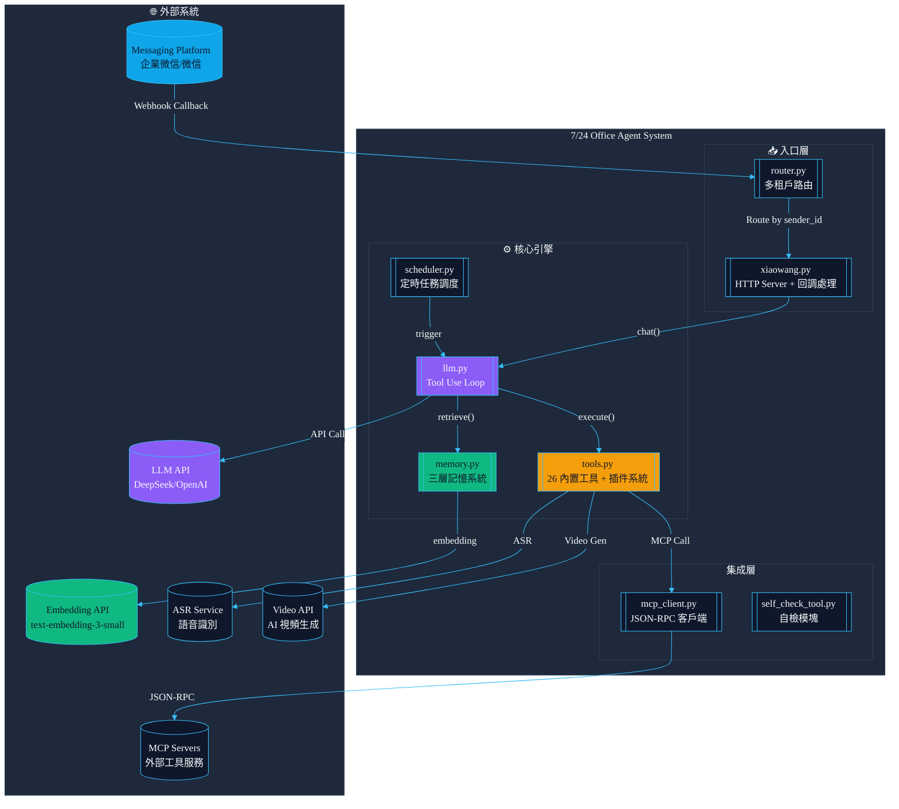

---

## 3. 模組依賴矩陣

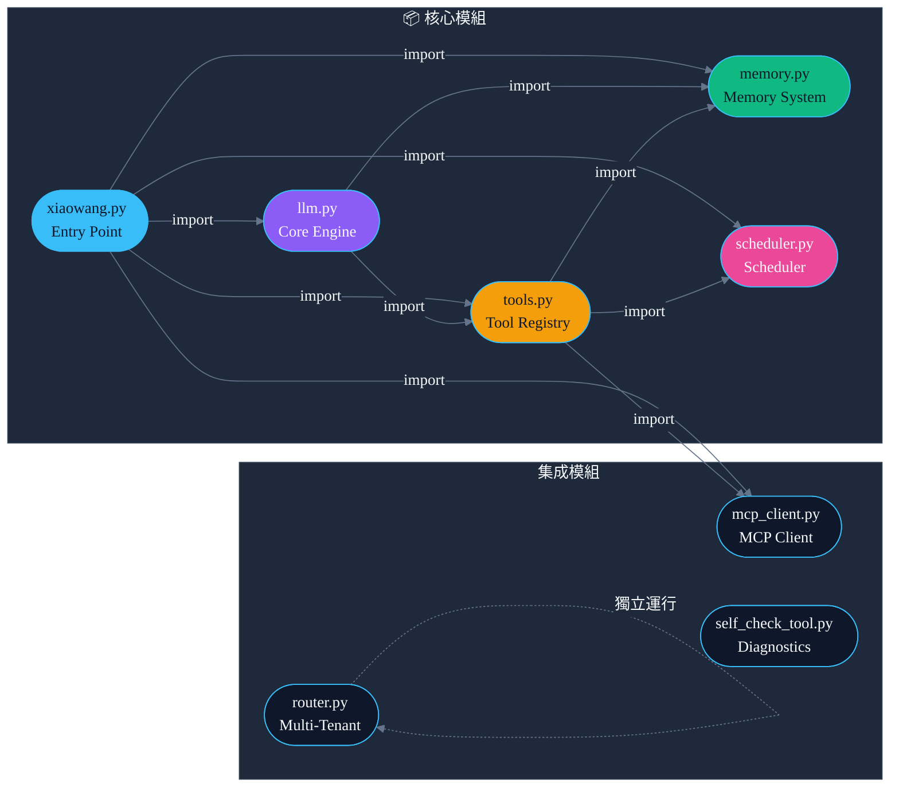

---

## 4. 核心業務流時序圖

### 4.1 用戶消息處理流程

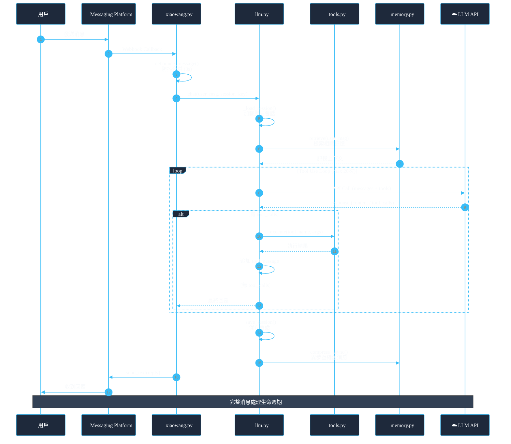

### 4.2 三層記憶系統流程

```mermaid
%%{init: {
  'theme': 'base',
  'themeVariables': {
    'primaryColor': '#1e293b',
    'primaryTextColor': '#f8fafc',
    'primaryBorderColor': '#38bdf8',
    'lineColor': '#64748b',
    'secondaryColor': '#0f172a',
    'tertiaryColor': '#1e293b',
    'mainBkg': '#0f172a',
    'nodeBorder': '#38bdf8',
    'clusterBkg': '#1e293b',
    'clusterBorder': '#334155',
    'titleColor': '#f8fafc',
    'edgeLabelBackground': '#1e293b',
    'actorBkg': '#1e293b',
    'actorTextColor': '#f8fafc',
    'actorBorder': '#38bdf8',
    'signalColor': '#38bdf8',
    'signalTextColor': '#f8fafc',
    'labelTextColor': '#f8fafc',
    'noteBkgColor': '#334155',
    'noteTextColor': '#f8fafc',
    'activationBkgColor': '#10b981',
    'activationBorderColor': '#10b981',
    'fontFamily': 'Outfit, Inter, system-ui'
  }
}}%%
sequenceDiagram
    autonumber
    participant LLM as 🧠 llm.py
    participant Mem as 💾 memory.py
    participant LLM_API as ☁️ LLM API
    participant Embed as 🔢 Embedding API
    participant DB as 🗄️ LanceDB

    rect rgb(30, 41, 59)
        Note over LLM,DB: Layer 1: Session Overflow
        LLM->>Mem: compress_async(evicted_msgs)
        Mem->>Mem: 啟動後台線程
    end
    
    rect rgb(30, 64, 59)
        Note over LLM,DB: Layer 2: Compress
        Mem->>LLM_API: LLM 提取結構化記憶
        LLM_API-->>Mem: [{fact, keywords, persons, timestamp}]
        
        Mem->>Embed: 獲取 fact 向量
        Embed-->>Mem: vectors[1024]
        
        Mem->>DB: 向量搜索 (餘弦相似度)
        DB-->>Mem: 最相似記憶
        
        alt 相似度 > 0.92
            Mem->>Mem: 跳過重複記憶
        else 相似度 <= 0.92
            Mem->>DB: 存儲新記憶
        end
    end
    
    rect rgb(59, 41, 59)
        Note over LLM,DB: Layer 3: Retrieve
        LLM->>Mem: retrieve(user_msg)
        Mem->>Embed: 獲取查詢向量
        Embed-->>Mem: query_vector
        Mem->>DB: 向量搜索 Top-K
        DB-->>Mem: 相關記憶列表
        Mem-->>LLM: 格式化記憶文本
    end
```

---

## 5. 模組複雜度分析

### 5.1 文件行數統計

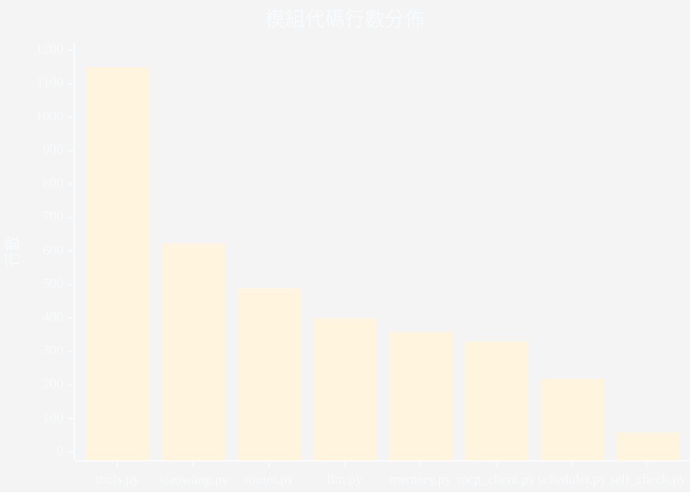

| 文件 | 行數 | 職責 | 複雜度評估 |
|:---|:---:|:---|:---|
| `tools.py` | ~1150 | 工具註冊 + 26 工具實現 + MCP 橋接 | **高** - 上帝類風險 |
| `xiaowang.py` | ~625 | 入口 + HTTP + 回調 + ASR + 防抖 | **中** - 職責過多 |
| `llm.py` | ~400 | Tool Use Loop + 會話管理 | **中** - 核心邏輯集中 |
| `router.py` | ~490 | 多租戶路由 + Docker API | **中** - 獨立服務 |
| `memory.py` | ~360 | 三層記憶 + 向量存儲 | **中** - 職責清晰 |
| `mcp_client.py` | ~330 | JSON-RPC + MCP 協議 | **低** - 單一職責 |
| `scheduler.py` | ~220 | 定時任務調度 | **低** - 單一職責 |
| `self_check_tool.py` | ~60 | 自檢文檔 | **低** - 文檔性質 |

### 5.2 潛在「上帝類」分析

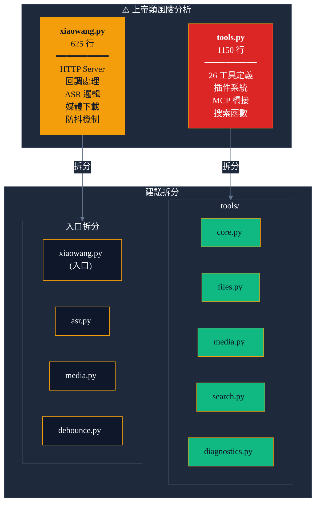

---

## 6. 架構模式審計

### 6.1 設計模式識別

| 模式 | 實現位置 | 符合度 | 評價 |
|:---|:---|:---:|:---|
| **註冊表模式** | `tools.py:33-55` | ✅ 優秀 | `@tool` 裝飾器優雅實現 |
| **依賴注入** | `llm.py:33-38` init() | ⚠️ 部分 | 全局變量注入，非構造函數 |
| **生產者-消費者** | `xiaowang.py:365-377` debounce | ✅ 優秀 | 緩衝區 + 定時器模式 |
| **策略模式** | `tools.py:705-760` web_search | ✅ 優秀 | 多搜索引擎路由 |
| **觀察者模式** | `scheduler.py:130-168` 任務觸發 | ⚠️ 簡化 | 回調函數而非事件總線 |
| **工廠模式** | `mcp_client.py:27-49` MCPServer | ⚠️ 部分 | 缺乏抽象接口 |

### 6.2 架構風格驗證

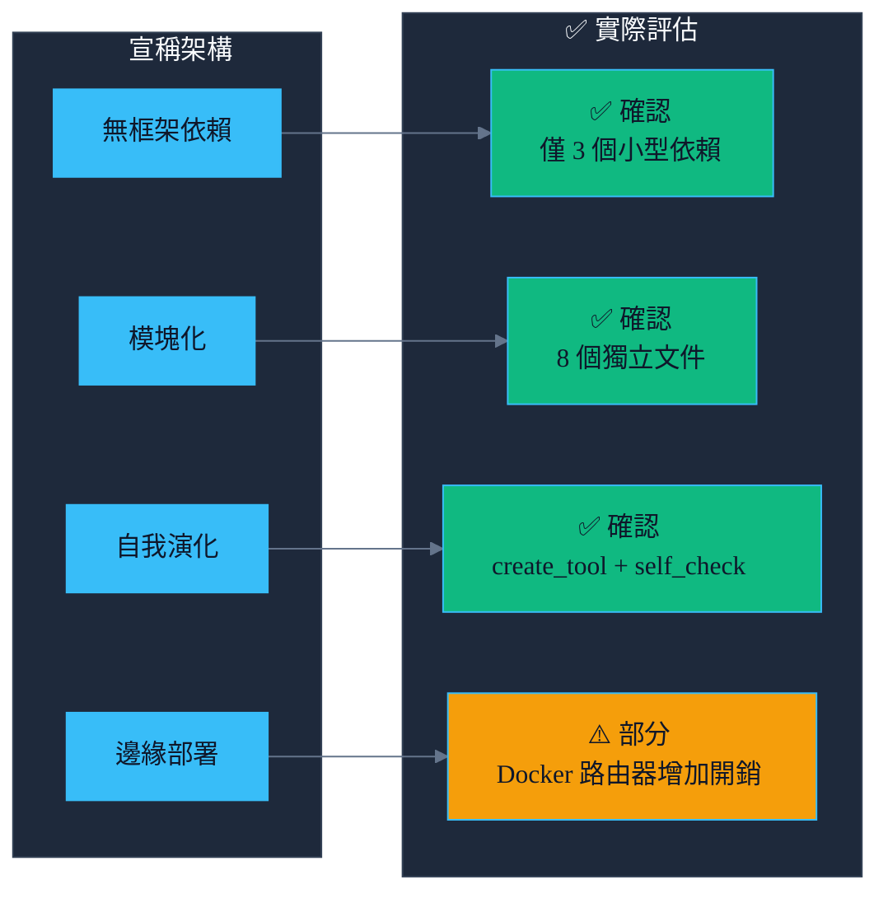

---

## 7. 數據一致性風險

### 7.1 異步流分析

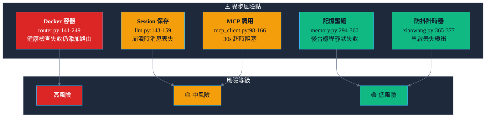

### 7.2 並發安全

**會話鎖機制** (`llm.py:306-321`)
```python
# 每個 session_key 一個鎖，防止並發消息交錯
_chat_locks = {}
_chat_locks_lock = threading.Lock()  # 鎖的鎖
```
- ✅ 線程安全設計
- ⚠️ 鎖粒度較粗，同一會話消息串行處理

---

## 8. P0 風險標記

### 8.1 安全風險

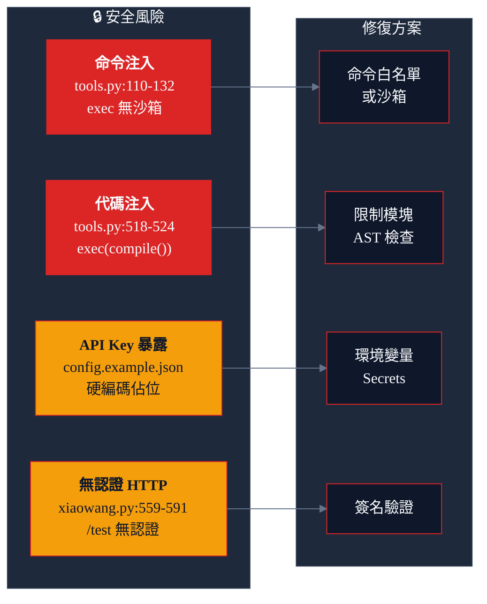

### 8.2 性能風險

| 風險 | 位置 | 描述 | 影響 |
|:---|:---|:---|:---|
| **同步 LLM 調用** | `llm.py:50-82` | urllib.request 同步阻塞 | 120s 超時阻塞線程 |
| **大文件處理** | `tools.py:193-201` | 圖片 base64 編碼內存中 | 內存峰值 |
| **會話消息膨脹** | `llm.py:30` | MAX_SESSION_MESSAGES=40 | 長對話 token 爆炸 |

---

## 9. 改進建議

### 9.1 短期改進 (1-2 周)

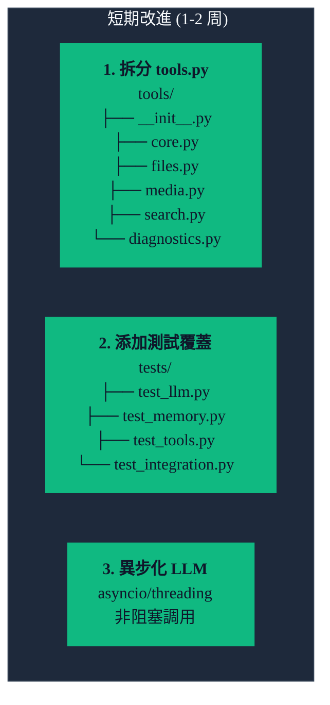

### 9.2 中期改進 (1-2 月)

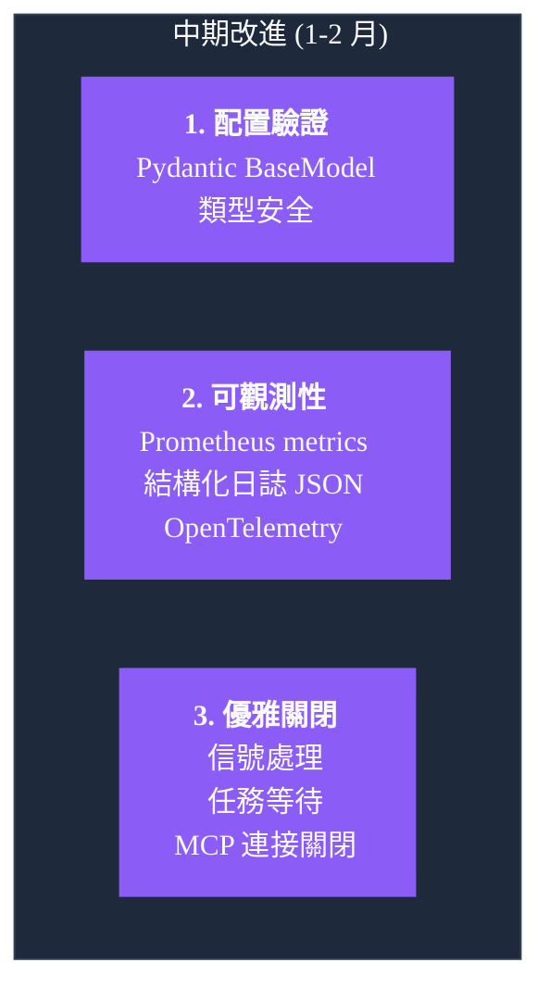

---

## 10. 審計檢查清單

- [x] **Check 1**: 已分析專案根目錄全部 8 個 Python 文件
- [x] **Check 2**: 改進建議包含具體代碼範例
- [x] **Check 3**: Mermaid 語法使用雙引號轉義，符合規範
- [x] **Check 4**: Mermaid 樣式使用 Modern Dark Neon 主題 + 語義化節點

---

**報告生成**: Claude Code Agent
**圖表優化**: Mermaid Pro Skill
**版本**: 1.1.0
**日期**: 2026-04-03
