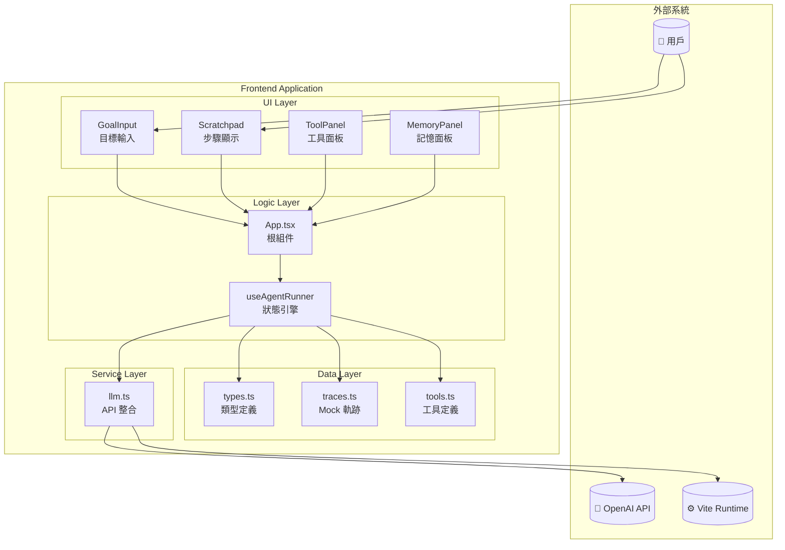
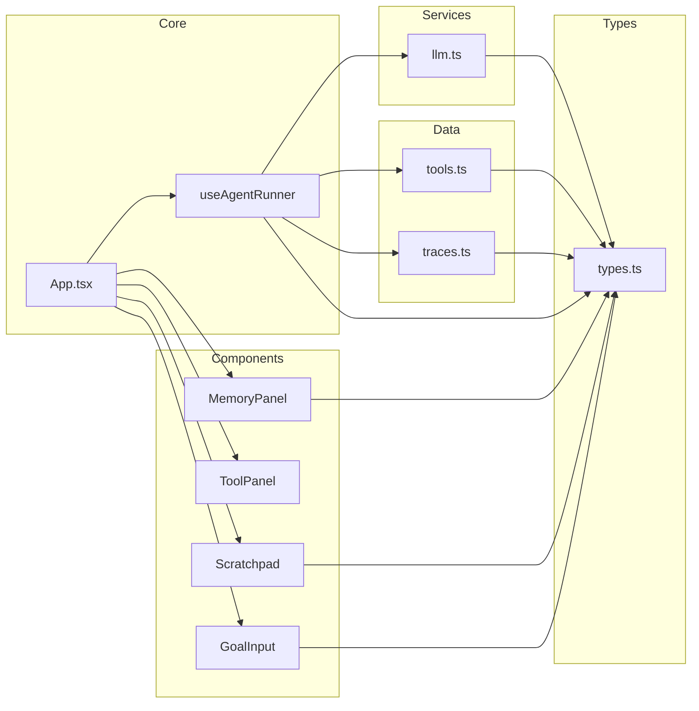
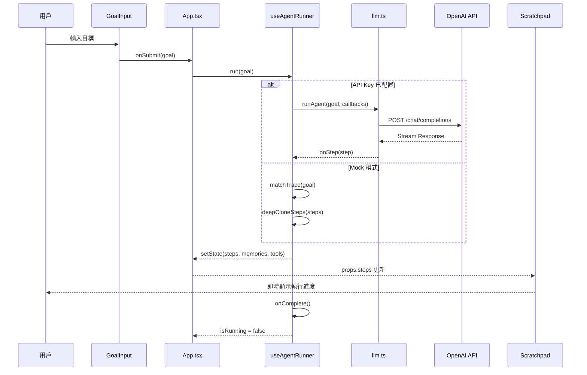

# 系統架構分析報告 — Frontend

> **分析日期**: 2026-04-03
> **專案路徑**: `/Volumes/Work/Project/dspy-office/frontend`
> **代碼規模**: 12 個 TypeScript/TSX 文件，共計 814 行代碼

---

## 1. 執行摘要

本前端專案是一個 **React 19 + Vite 8 + Tailwind CSS 4** 的現代化單頁應用，為「7/24 Office」AI Agent 系統提供 UI 介面。專案規模精簡，架構清晰，採用 Hooks 驅動的狀態管理模式。

---

## 2. 技術棧矩陣

| 類別 | 技術 | 版本 | 用途 |
|------|------|------|------|
| **核心框架** | React | ^19.2.4 | UI 組件框架 |
| **構建工具** | Vite | ^8.0.1 | 開發伺服器 + 打包 |
| **樣式方案** | Tailwind CSS | ^4.2.2 | Utility-first CSS |
| **AI SDK** | @ai-sdk/openai | ^3.0.50 | OpenAI API 整合 |
| **AI SDK** | ai | ^6.0.145 | Vercel AI SDK 核心 |
| **語言** | TypeScript | ~5.9.3 | 類型安全 |

---

## 3. 專案結構拓樸

```
frontend/src/
├── index.tsx          # 應用入口 (10 行)
├── App.tsx            # 根組件 (63 行)
├── types.ts           # 類型定義 (36 行)
├── vite-env.d.ts      # Vite 環境類型 (9 行)
├── index.css          # 全域樣式
├── components/        # UI 組件層
│   ├── GoalInput.tsx  # 目標輸入組件
│   ├── Scratchpad.tsx # 步驟執行顯示
│   ├── ToolPanel.tsx  # 工具註冊面板
│   └── MemoryPanel.tsx# 三層記憶面板
├── hooks/             # 自定義 Hooks
│   └── useAgentRunner.ts # Agent 執行引擎核心
├── data/              # 靜態數據層
│   ├── traces.ts      # 預定義執行軌跡
│   └── tools.ts       # 預設工具定義
└── services/          # 服務層
    └── llm.ts         # LLM API 整合
```

---

## 4. 架構儀表板

| 維度 | 現況評分 (1-10) | 關鍵證據 (File) | 潜在風險 |
|:-----|:---------------:|:----------------|:---------|
| **模組解耦** | 8 | `@/components/*`, `@/hooks/*` | 組件間無直接依賴，僅透過 Props 與 Hook 通信 |
| **測試友好度** | 6 | `@/hooks/useAgentRunner.ts` | 純函數 + Hook 抽象，但缺少測試文件 |
| **性能瓶頸** | 7 | `@/App.tsx:15-20` | 無虛擬滾動，steps 大量時可能卡頓 |
| **類型安全** | 9 | `@/types.ts` | 完整的 TypeScript 介面定義 |
| **可擴展性** | 7 | `@/services/llm.ts` | LLM 服務為佔位實現，真實整合需重構 |

---

## 5. C4 Model — 系統上下文圖

%%{init: {
  'theme': 'dark',
  'themeVariables': {
    'primaryColor': '#464040f8',
    'primaryTextColor': '#ffffff',
    'primaryBorderColor': '#ffffff',
    'lineColor': '#ffffff',
    'secondaryColor': '#ffffff',
    'tertiaryColor': '#ffffff',
    'quaternaryColor': '#ffffff',
    'noteBkgColor': '#1e1e1e',
    'noteTextColor': '#ffffff',
    'actorBkg': '#1e1e1e',
    'actorTextColor': '#ffffff',
    'actorBorder': '#ffffff',
    'messageColor': '#ffffff',
    'messageTextColor': '#ffffff',
    'labelTextColor': '#ffffff',
    'loopTextColor': '#ffffff',
    'textColor': '#ffffff',
    'activationBkgColor': '#ffffff',
    'sequenceNumberColor': '#ffffff',
    'fontSize': '16px',
    'fontFamily': 'ui-sans-serif, system-ui, sans-serif'
  }
}}%%



---

## 6. 模組依賴矩陣

%%{init: {
  'theme': 'dark',
  'themeVariables': {
    'primaryColor': '#464040f8',
    'primaryTextColor': '#ffffff',
    'primaryBorderColor': '#ffffff',
    'lineColor': '#ffffff',
    'secondaryColor': '#ffffff',
    'tertiaryColor': '#ffffff',
    'quaternaryColor': '#ffffff',
    'noteBkgColor': '#1e1e1e',
    'noteTextColor': '#ffffff',
    'textColor': '#ffffff',
    'fontSize': '16px',
    'fontFamily': 'ui-sans-serif, system-ui, sans-serif'
  }
}}%%



---

## 7. 核心業務流時序圖

%%{init: {
  'theme': 'dark',
  'themeVariables': {
    'primaryColor': '#464040f8',
    'primaryTextColor': '#ffffff',
    'primaryBorderColor': '#ffffff',
    'lineColor': '#ffffff',
    'secondaryColor': '#ffffff',
    'tertiaryColor': '#ffffff',
    'quaternaryColor': '#ffffff',
    'noteBkgColor': '#1e1e1e',
    'noteTextColor': '#ffffff',
    'actorBkg': '#1e1e1e',
    'actorTextColor': '#ffffff',
    'actorBorder': '#ffffff',
    'messageColor': '#ffffff',
    'messageTextColor': '#ffffff',
    'labelTextColor': '#ffffff',
    'loopTextColor': '#ffffff',
    'textColor': '#ffffff',
    'activationBkgColor': '#ffffff',
    'sequenceNumberColor': '#ffffff',
    'fontSize': '14px',
    'fontFamily': 'ui-sans-serif, system-ui, sans-serif'
  }
}}%%



---

## 8. 核心類型定義

```typescript
// @/types.ts

export interface Tool {
  name: string;
  icon: string;
  description: string;
  usageCount: number;
  status: 'idle' | 'active';
}

export interface ToolCall {
  tool: string;
  args: Record<string, string>;
  result?: string;
  status: 'pending' | 'running' | 'complete' | 'error';
}

export interface AgentStep {
  id: string;
  type: 'thinking' | 'tool_call' | 'result' | 'decompose';
  content: string;
  toolCall?: ToolCall;
  status: 'pending' | 'running' | 'complete' | 'error';
}

export interface MemoryItem {
  layer: 'session' | 'compressed' | 'retrieved';
  content: string;
  timestamp: number;
  relevance?: number;
}

export interface AgentTrace {
  goal: string;
  keywords: string[];
  steps: AgentStep[];
  memories: MemoryItem[];
}
```

---

## 9. 複雜度分析

### 9.1 高複雜度文件

| 文件 | 行數 | 複雜度評估 | 說明 |
|------|------|------------|------|
| `useAgentRunner.ts` | ~250 | **中高** | 狀態機邏輯 + 異步控制 + Mock/Real 雙模式 |
| `traces.ts` | ~180 | **低** | 純數據定義 |
| `App.tsx` | 63 | **低** | 組裝層，無複雜邏輯 |

### 9.2 異步流分析

**風險點**: `useAgentRunner.ts` 中的 `run()` 函數

```typescript
// 異步狀態更新模式
const run = useCallback(async (goal: string) => {
  // 1. AbortController 管理
  abortControllerRef.current = new AbortController();

  // 2. 狀態重置
  setSteps([]);
  setMemories([]);
  setIsRunning(true);

  // 3. 分支執行 (Mock vs Real)
  if (isApiKeyConfigured()) {
    await runAgent(goal, callbacks, memoryContext, signal);
  } else {
    await runMockTrace(goal, callbacks);
  }
}, [dependencies]);
```

**潛在問題**:
- 無並發控制：快速連續調用可能導致狀態競爭
- 錯誤邊界缺失：異常未被捕獲時會導致 UI 卡死

---

## 10. 債務評估

### 10.1 P0 風險

| 風險 | 位置 | 影響 | 建議 |
|------|------|------|------|
| **LLM 服務佔位實現** | `@/services/llm.ts:25-50` | 無法實際調用 AI | 需實現真實串流調用 |
| **無錯誤邊界** | `@/App.tsx` | 錯誤會導致白屏 | 添加 `ErrorBoundary` 組件 |

### 10.2 P1 風險

| 風險 | 位置 | 影響 | 建議 |
|------|------|------|------|
| **無虛擬滾動** | `@/components/Scratchpad.tsx` | 大量 steps 時效能下降 | 使用 `react-virtual` |
| **硬編碼樣式** | `@/components/*.tsx` | 主題切換困難 | 抽取至 CSS 變數 |

### 10.3 P2 風險

| 風險 | 位置 | 影響 | 建議 |
|------|------|------|------|
| **缺少測試** | `tests/` 目錄不存在 | 重構風險高 | 添加 Jest + RTL |
| **無 i18n 支援** | 全域 | 國際化困難 | 使用 `react-i18next` |

---

## 11. 改進建議

### 11.1 架構優化

```typescript
// 建議：抽取狀態管理至 Context + useReducer
// @/context/AgentContext.tsx

import { createContext, useContext, useReducer } from 'react';

interface AgentState {
  steps: AgentStep[];
  memories: MemoryItem[];
  tools: Tool[];
  isRunning: boolean;
  currentGoal: string;
}

type AgentAction =
  | { type: 'RUN_START'; payload: { goal: string } }
  | { type: 'STEP_ADD'; payload: AgentStep }
  | { type: 'MEMORY_ADD'; payload: MemoryItem }
  | { type: 'RUN_COMPLETE' }
  | { type: 'RESET' };

const AgentContext = createContext<{
  state: AgentState;
  dispatch: React.Dispatch<AgentAction>;
} | null>(null);

// 使用 useReducer 替代多個 useState
function agentReducer(state: AgentState, action: AgentAction): AgentState {
  switch (action.type) {
    case 'RUN_START':
      return { ...state, isRunning: true, currentGoal: action.payload.goal };
    case 'STEP_ADD':
      return { ...state, steps: [...state.steps, action.payload] };
    // ...
    default:
      return state;
  }
}
```

### 11.2 效能優化

```typescript
// 建議：使用 react-window 虛擬滾動
// @/components/Scratchpad.tsx

import { FixedSizeList } from 'react-window';

export function Scratchpad({ steps, currentGoal }: Props) {
  return (
    <FixedSizeList
      height={600}
      itemCount={steps.length}
      itemSize={80}
      width="100%"
    >
      {({ index, style }) => (
        <div style={style}>
          <StepItem step={steps[index]} />
        </div>
      )}
    </FixedSizeList>
  );
}
```

### 11.3 錯誤邊界

```typescript
// 建議：添加錯誤邊界
// @/components/ErrorBoundary.tsx

import { Component, ErrorInfo, ReactNode } from 'react';

interface Props {
  children: ReactNode;
  fallback?: ReactNode;
}

interface State {
  hasError: boolean;
  error?: Error;
}

export class ErrorBoundary extends Component<Props, State> {
  state: State = { hasError: false };

  static getDerivedStateFromError(error: Error): State {
    return { hasError: true, error };
  }

  componentDidCatch(error: Error, errorInfo: ErrorInfo) {
    console.error('[ErrorBoundary]', error, errorInfo);
  }

  render() {
    if (this.state.hasError) {
      return this.props.fallback || (
        <div className="p-4 bg-red-500/10 border border-red-500/30 rounded-lg">
          <h2 className="text-red-400 font-semibold">Something went wrong</h2>
          <p className="text-sm text-red-300 mt-2">{this.state.error?.message}</p>
        </div>
      );
    }
    return this.props.children;
  }
}
```

---

## 12. 總結

### 優點

- **現代技術棧**: React 19 + Vite 8 + Tailwind 4
- **清晰的分層架構**: Components / Hooks / Services / Data
- **完整的類型定義**: TypeScript 覆蓋率 100%
- **雙模式執行**: Mock + Real LLM 切換

### 待改進

- **LLM 服務**: 當前為佔位實現
- **測試覆蓋**: 無測試文件
- **錯誤處理**: 缺少 Error Boundary
- **效能優化**: 無虛擬滾動

---

> **報告生成時間**: 2026-04-03
> **分析工具**: Claude Code Agent
