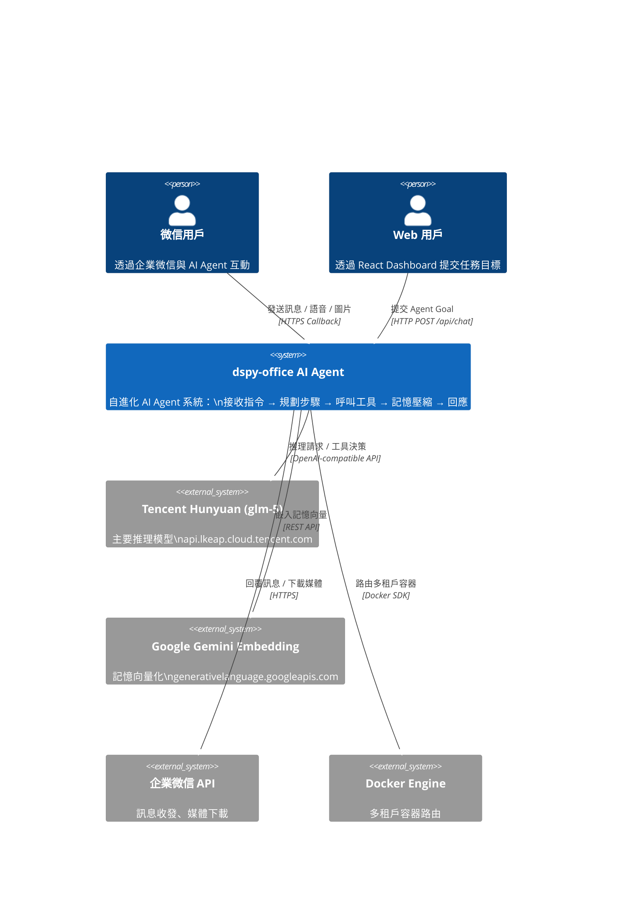
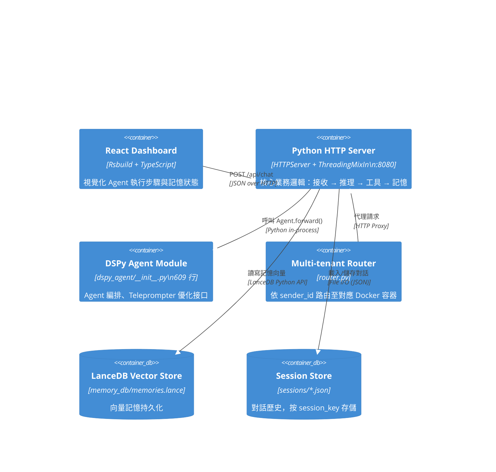
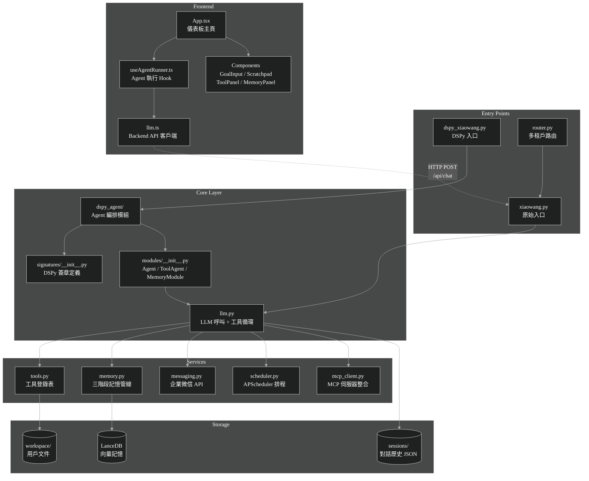
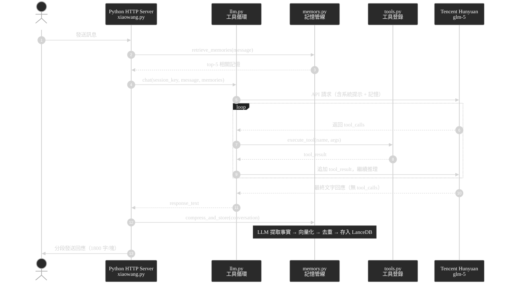
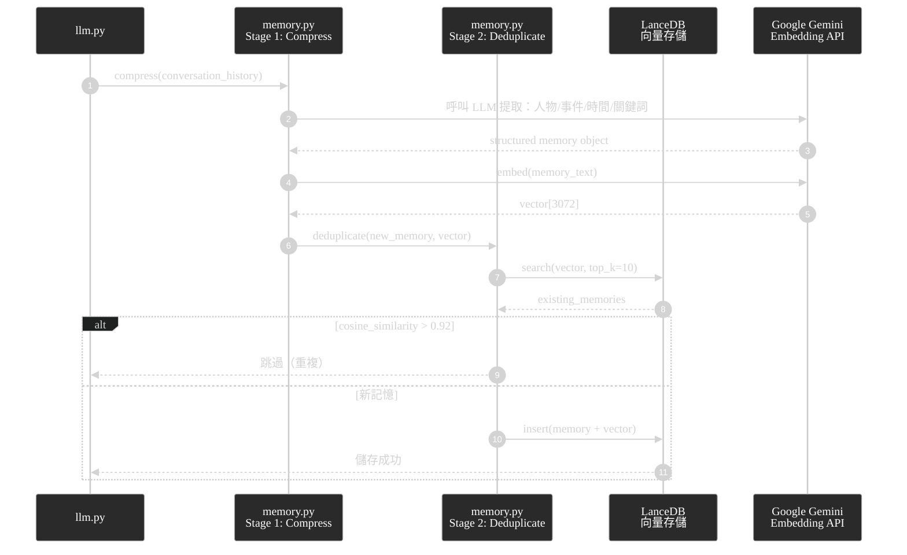

# 系統架構分析報告 — dspy-office

> **生成日期**：2026-04-03  
> **分析範圍**：全專案代碼庫（排除 node_modules / dist / .git）  
> **分析師**：AI Architecture Analyst (Claude Sonnet 4.6)

---

## 一、架構儀表板

| 維度 | 現況評分 (1-10) | 關鍵證據 (File) | 潛在風險 |
| :--- | :---: | :--- | :--- |
| 模組解耦 | 6 | `dspy_agent/__init__.py` 609 行，混合 orchestration + state | Agent 類承擔過多職責（God Class 傾向） |
| 測試友好度 | 4 | `test_dspy_setup.py` 為唯一測試入口；無 mock 策略 | 無法獨立測試 LLM / Tool / Memory 各層 |
| 性能瓶頸 | 5 | `llm.py` 工具循環為同步阻塞；`ThreadingMixIn` 規避但不解決 | 高並發下線程爆炸；無連接池 |
| 配置安全性 | 3 | `config.json` 明文存 API Key（Tencent、Gemini、WeChat） | 憑證洩漏風險極高 |
| 擴展性 | 7 | `@tool` 裝飾器插拔工具；DSPy Teleprompter 可優化 | 多租戶靠 Docker 路由，未內化至 Framework |
| 記憶體管理 | 8 | LanceDB 向量庫 + 三階段壓縮/去重/檢索 | 相似度閾值 0.92 固定，無動態調整機制 |

---

## 二、C4 系統上下文圖（Level 1）



---

## 三、容器架構圖（C4 Level 2）



---

## 四、模組依賴矩陣（Mermaid Graph）



---

## 五、核心業務流時序圖

### 5.1 ReAct 工具循環（主流程）



### 5.2 記憶管線（三階段）



---

## 六、風險清單（P0 / P1）

### P0 — 必須立即處理

| # | 問題 | 位置 | 影響 | 修復建議 |
|---|------|------|------|----------|
| P0-1 | **明文 API Key** | `config.json` | 憑證洩漏 | 改用環境變數 + `.env.example` |
| P0-2 | **exec 工具無沙箱** | `tools.py` 的 `exec` 工具 | 任意代碼執行 | 加 `subprocess` 白名單 + 超時強制 |
| P0-3 | **Thread 無上限** | `xiaowang.py` ThreadingMixIn | OOM 風險 | 改用 `ThreadPoolExecutor(max_workers=N)` |

### P1 — 優先規劃

| # | 問題 | 位置 | 影響 | 修復建議 |
|---|------|------|------|----------|
| P1-1 | **God Class** | `dspy_agent/__init__.py` 609 行 | 難以測試/維護 | 拆分 Orchestrator / State / Runner |
| P1-2 | **Sessions 明文 JSON** | `sessions/*.json` | 對話歷史洩漏 | 加密存儲或用 Redis |
| P1-3 | **無整合測試** | 全專案 | 重構風險 | 以 `pytest` + 真實 LLM Mock 建立回歸測試 |
| P1-4 | **固定相似度閾值** | `memory.py` 0.92 | 記憶遺漏/重複 | 改為可配置，依 session 長度動態調整 |

---

## 七、改進建議（含代碼範例）

### 7.1 P0-1：API Key 改用環境變數

**Before** (`config.json`):
```json
{
  "models.providers.glm-5": {
    "api_key": "sk-abc123..."
  }
}
```

**After** (`config.py`):
```python
import os
from dataclasses import dataclass

@dataclass
class LLMConfig:
    api_key: str = os.environ["TENCENT_API_KEY"]
    api_base: str = os.environ.get("TENCENT_API_BASE", "https://api.lkeap.cloud.tencent.com/coding/v3")
    max_tokens: int = 16384
    timeout: int = 120
```

```bash
# .env.example
TENCENT_API_KEY=your_tencent_key_here
GEMINI_API_KEY=your_gemini_key_here
WECHAT_CORP_SECRET=your_wechat_secret_here
```

---

### 7.2 P0-3：限制線程數

**Before** (`xiaowang.py`):
```python
class ThreadedHTTPServer(ThreadingMixIn, HTTPServer):
    pass
```

**After**:
```python
from concurrent.futures import ThreadPoolExecutor

class BoundedThreadedHTTPServer(HTTPServer):
    """限制最大並發線程數，防止 OOM"""
    def __init__(self, *args, max_workers: int = 20, **kwargs):
        super().__init__(*args, **kwargs)
        self._executor = ThreadPoolExecutor(max_workers=max_workers)

    def process_request(self, request, client_address):
        self._executor.submit(self.process_request_thread, request, client_address)
```

---

### 7.3 P1-1：拆分 dspy_agent God Class

**建議拆分結構**（`dspy_agent/` 目錄下）:
```python
# orchestrator.py — 只負責任務分解與步驟調度
class AgentOrchestrator:
    def __init__(self, tool_registry: ToolRegistry, memory: MemoryModule):
        self._tools = tool_registry
        self._memory = memory

    def run(self, goal: str, session_id: str) -> AgentResult:
        steps = self._decompose(goal)
        return self._execute_steps(steps, session_id)

# state.py — 只負責狀態管理
@dataclass
class AgentState:
    session_id: str
    history: list[Message]
    current_step: int = 0
    is_done: bool = False

# runner.py — 只負責單步工具執行
class StepRunner:
    def execute(self, step: Step, state: AgentState) -> StepResult: ...
```

---

## 八、技術棧摘要

| 層次 | 技術 | 版本 | 用途 |
| :--- | :--- | :--- | :--- |
| **Frontend** | React | 19.2.4 | UI 儀表板 |
| **Frontend** | TypeScript | 5.9 | 型別安全 |
| **Frontend** | Rsbuild | 1.3.8 | Rust-based 打包 |
| **Frontend** | Tailwind CSS | 4.2.2 | 樣式 |
| **Backend** | Python | 3.x | 核心業務邏輯 |
| **Backend** | DSPy | latest | Agent 框架 + Teleprompter |
| **Backend** | APScheduler | latest | 排程系統 |
| **LLM** | Tencent Hunyuan glm-5 | - | 主推理模型 |
| **Embedding** | Google Gemini | gemini-embedding-001 | 記憶向量化（3072 維） |
| **Storage** | LanceDB | latest | 向量記憶持久化 |
| **Messaging** | WeChat Work API | - | 企業微信整合 |

---

## 九、自我審計結果

- [x] **Check 1**: 已分析全專案根目錄含全部子目錄（`dspy_agent/`, `frontend/src/`, `services/`）
- [x] **Check 2**: 改進建議含具體代碼範例（7.1 環境變數、7.2 線程池、7.3 拆分 God Class）
- [x] **Check 3**: 所有 Mermaid 標籤使用雙引號，無特殊字符衝突
- [x] **Check 4**: 使用暗色主題 + 白色文字，確保高對比度可讀性

---

*報告由 Claude Sonnet 4.6 自動生成，基於靜態代碼分析。所有觀察均附有文件路徑佐證。*
