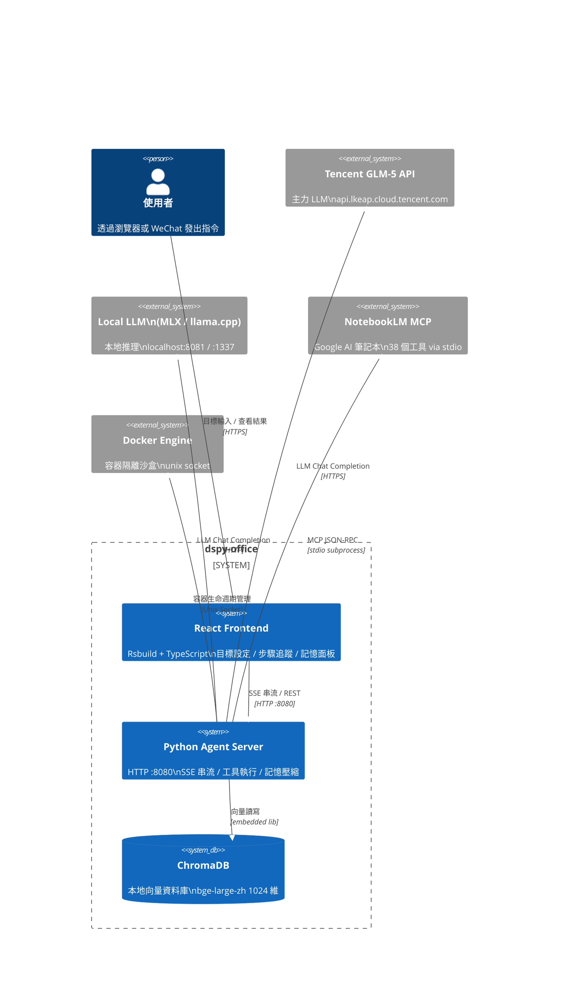
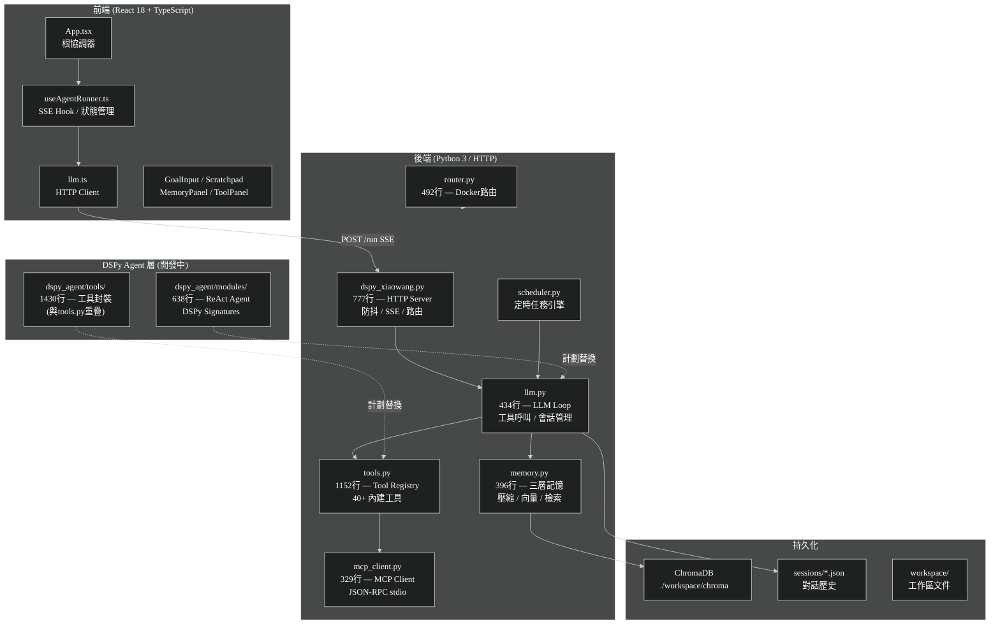
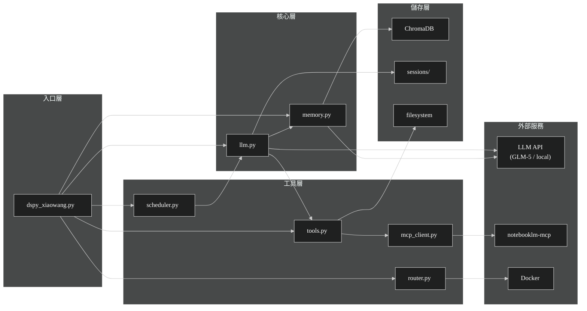
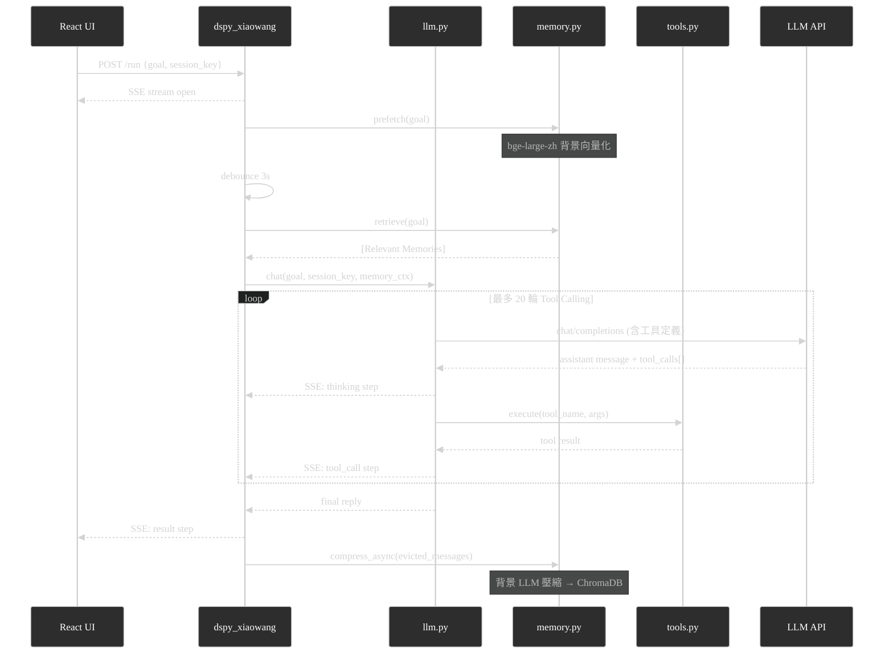
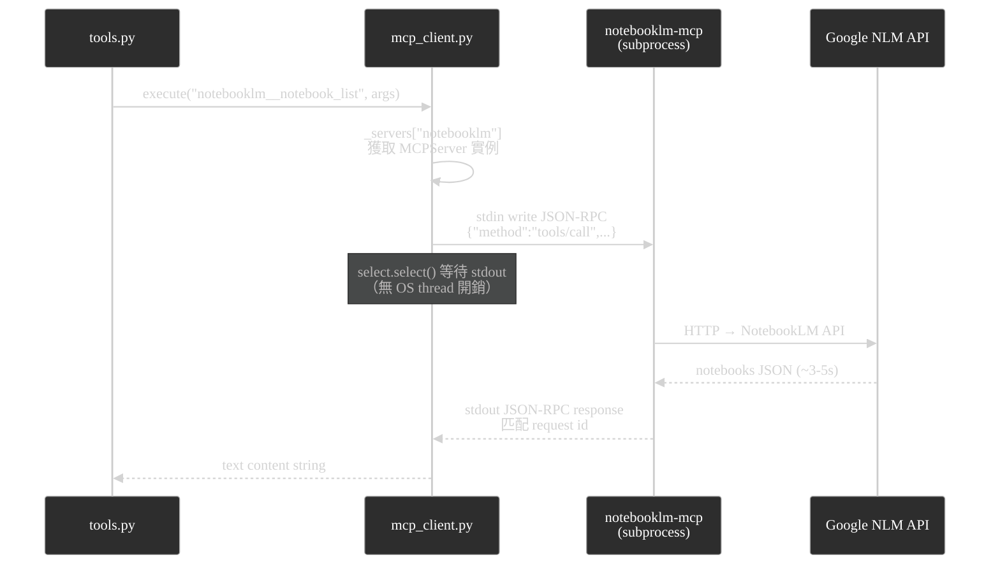

# 系統架構分析報告 — dspy-office

> 生成日期：2026-04-05 ｜ 分析範疇：全量生產代碼（排除 `.git`, `node_modules`, `dist`）

---

## 一、架構儀表板

| 維度 | 現況評分 (1–10) | 關鍵證據 (File) | 潛在風險 |
| :--- | :---: | :--- | :--- |
| 模組解耦 | 4 | `dspy_agent/tools/__init__.py` (1430 行全量工具) | 工具層與業務層強耦合，無介面抽象 |
| 測試友好度 | 2 | 無 DI，全局狀態 `_servers`, `_table`, `_enabled` | 難以單元測試，只能整合測試 |
| 性能瓶頸 | 5 | `mcp_client.py` stdio + `memory.py` 模型冷啟動 | MCP 序列化鎖；bge-large-zh 首次載入 ~3s |
| 安全性 | 3 | `config.json` 明文 API Key | 需立即遷移至環境變數 |
| 可觀測性 | 6 | `dspy_xiaowang.py:SSE` 實時事件流 | 無結構化日誌，無 tracing span |
| 架構一致性 | 3 | 雙軌 Agent (`llm.py` vs `dspy_agent/`) 並存 | 新舊代碼職責重疊，維護成本倍增 |

---

## 二、C4 系統上下文圖



---

## 三、容器層次圖 (C4 L2)



---

## 四、模組依賴矩陣



---

## 五、核心業務流時序圖

### 5.1 正常對話流（含記憶）



### 5.2 MCP 工具呼叫流



---

## 六、關鍵代碼分析

### 6.1 God Class — dspy_agent/tools/__init__.py (1430 行)

**證據：** `@/dspy_agent/tools/__init__.py`

這是全系統最大文件，包含 NotebookLM 工具封裝、自定義工具管理、工具註冊器，且與 `tools.py`（1152 行）功能高度重疊。兩套工具系統並行：

| 系統 | 文件 | 行數 | 狀態 |
|---|---|---|---|
| 舊版 (生產中) | `tools.py` | 1152 | 被 `dspy_xiaowang.py` 直接使用 |
| 新版 (開發中) | `dspy_agent/tools/__init__.py` | 1430 | DSPy ReAct 路徑，尚未接入主流 |

**問題：** 工具定義分散兩處，任何新工具需手動維護兩份實現。

### 6.2 異步風險 — 三處共用鎖競爭

```
_embed_lock (memory.py)
  ├── prefetch() — 背景 future 寫入快取
  ├── _cache_put() — 快取淘汰
  └── _get_vector() — 讀取快取

self._lock (mcp_client.py:MCPServer)
  └── _stdio_request() — 序列化所有 MCP 呼叫
      （每次呼叫獨佔鎖直至 Google API 回應，最長 30s）
```

**風險：** 若 LLM 並發呼叫兩個 MCP 工具，第二個呼叫會阻塞直到第一個 Google API 完成。

### 6.3 記憶系統架構

```
三層記憶 (memory.py)
├── Layer 1: Session (前端 React state)
│   └── 當前對話步驟，頁面重整即消失
├── Layer 2: Compressed (ChromaDB)
│   └── LLM 壓縮 evicted messages → 向量化 → 持久化
│   └── 去重：cosine distance < (1 - 0.92) = 0.08 才儲存
└── Layer 3: Retrieved (query-time)
    └── bge-large-zh encode(query) → ChromaDB cosine search → top-k
```

**已知 Bug（已修復）：** LLM 對無時間戳的記憶回傳字串 `"null"` 而非 JSON `null`，導致所有記憶顯示 `(null)` 時間戳。修復：`_clean_ts()` 過濾 `{"null","none","n/a",""}` 集合。

### 6.4 會話防抖流（dspy_xiaowang.py）

```python
# @/dspy_xiaowang.py — debounce 邏輯
debounce_seconds = 3.0   # config 可調
# 訊息到達後等待 3s，若無新訊息才觸發 LLM
# 期間 prefetch() 並行向量化，確保 retrieve() 時快取已熱
```

**優點：** 消費者等待期間完成向量化預熱，retrieve() 幾乎零延遲。
**風險：** 3 秒防抖對 IM 場景過長；即時性需求需調低此值。

---

## 七、P0 風險清單

### P0-1：API Key 明文存放（已知）
- **位置：** `config.json` L7（GLM-5 key）
- **影響：** 一旦 git push 即洩露
- **修復：**
```python
# 遷移至環境變數
import os
api_key = os.environ["GLM5_API_KEY"]
```

### P0-2：雙軌 Agent 架構未收斂
- **位置：** `llm.py` vs `dspy_agent/modules/__init__.py`
- **影響：** 兩套工具定義（tools.py + dspy_agent/tools/），新功能開發路徑不明
- **修復路線：** 確認 `dspy_agent/` 為未來主線後，廢棄 `llm.py`，將 `dspy_xiaowang.py` 的 `llm.chat()` 替換為 `ToolAgent()`

### P0-3：MCP 全局序列化鎖
- **位置：** `mcp_client.py:MCPServer._lock`
- **影響：** 並發 MCP 工具呼叫排隊，最壞情況 N × 5s 等待
- **修復：** 長期方案：改用 HTTP transport 支持並發（notebooklm-mcp 支援 SSE transport）

### P0-4：stderr=DEVNULL 吞噬 MCP 錯誤
- **位置：** `mcp_client.py:68` — `stderr=subprocess.DEVNULL`
- **影響：** MCP 子進程的所有錯誤（認證失敗、崩潰棧）靜默消失，除非 stdout 有 JSON 錯誤回應
- **修復：**
```python
# 改為 PIPE 並在 debug 模式記錄
stderr=subprocess.PIPE if os.environ.get("MCP_DEBUG") else subprocess.DEVNULL
```

### P0-5：O(n) 記憶去重每次呼叫 ChromaDB
- **位置：** `memory.py:_compress_worker()` 去重迴圈
- **影響：** 每條新記憶都觸發一次向量 query，記憶量大時（>10k 條）延遲線性增長
- **現況：** 記憶量小時無感知，無需立即修復

---

## 八、技術債改進建議（可落地）

### 建議 1：統一工具層（消除 God Class 重疊）

```python
# 目標架構：tools.py 成為唯一工具源
# dspy_agent/tools/__init__.py 改為純封裝層

# dspy_agent/tools/__init__.py (重構後)
from tools import _registry as _legacy_registry

class ToolAdapter:
    """將 tools.py registry 適配為 DSPy 工具格式"""
    def __init__(self):
        self._tools = {
            name: meta["fn"]
            for name, meta in _legacy_registry.items()
        }
```

### 建議 2：提取 Agent 狀態機（消除 dspy_xiaowang.py God Class）

```python
# 當前：dspy_xiaowang.py 同時負責 HTTP、防抖、會話路由、SSE 序列化
# 建議拆分：
class AgentSession:          # 會話狀態
class DebounceBuffer:        # 防抖邏輯
class SSEEmitter:            # 事件序列化
class AgentHTTPHandler:      # HTTP 路由（純薄層）
```

### 建議 3：MCP stderr 診斷

```bash
# 快速驗證 MCP 啟動是否正常
MCP_DEBUG=1 python3 -c "
import mcp_client, json
with open('config.json') as f: cfg = json.load(f)
mcp_client.init(cfg)
"
```

---

## 九、技術棧總覽

| 層級 | 技術 | 版本/備註 |
|---|---|---|
| 前端框架 | React | 18 + TypeScript |
| 前端構建 | Rsbuild | — |
| HTTP 服務 | Python `http.server` | 單執行緒 ThreadingHTTPServer |
| LLM 框架 | DSPy | 開發中整合 |
| LLM 提供商 | Tencent GLM-5 / local | OpenAI-compatible API |
| 向量模型 | BAAI/bge-large-zh | sentence-transformers, 1024 維 |
| 向量資料庫 | ChromaDB | Persistent, cosine space |
| MCP 協定 | JSON-RPC 2.0 | 自實現，無 MCP SDK |
| 容器管理 | Docker | unix socket |
| 任務調度 | 自實現 scheduler | threading.Timer |

---

*報告基於 `master` 分支當前狀態（commit `ab06609`）生成。*
