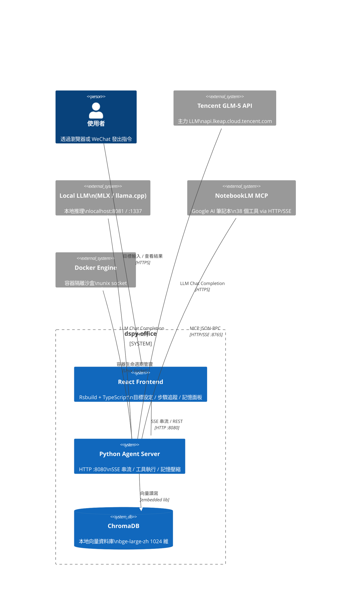
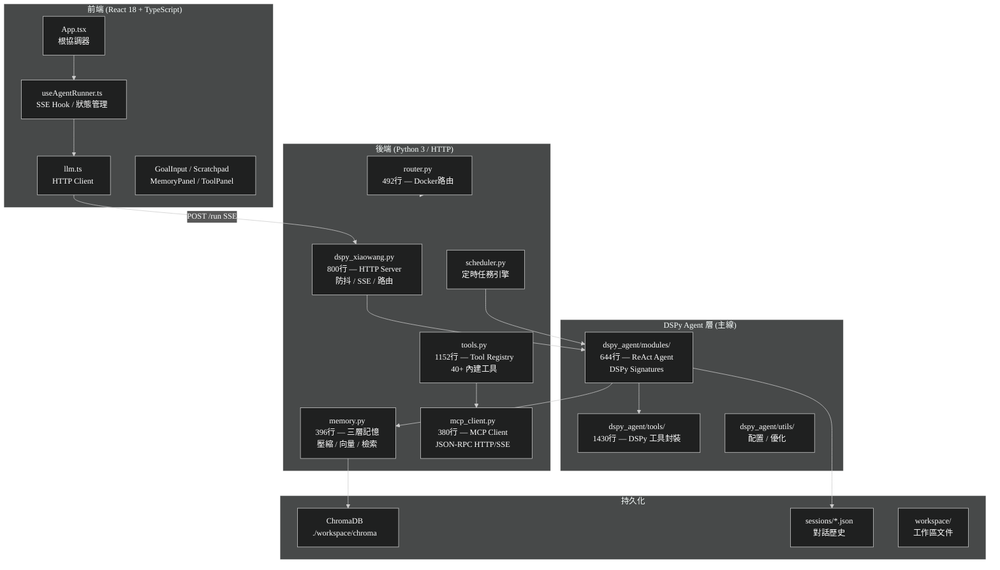
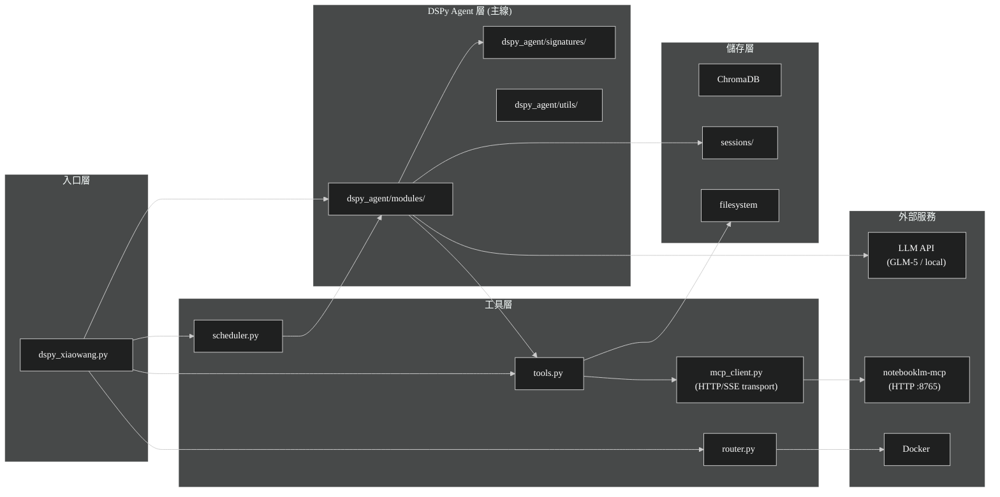
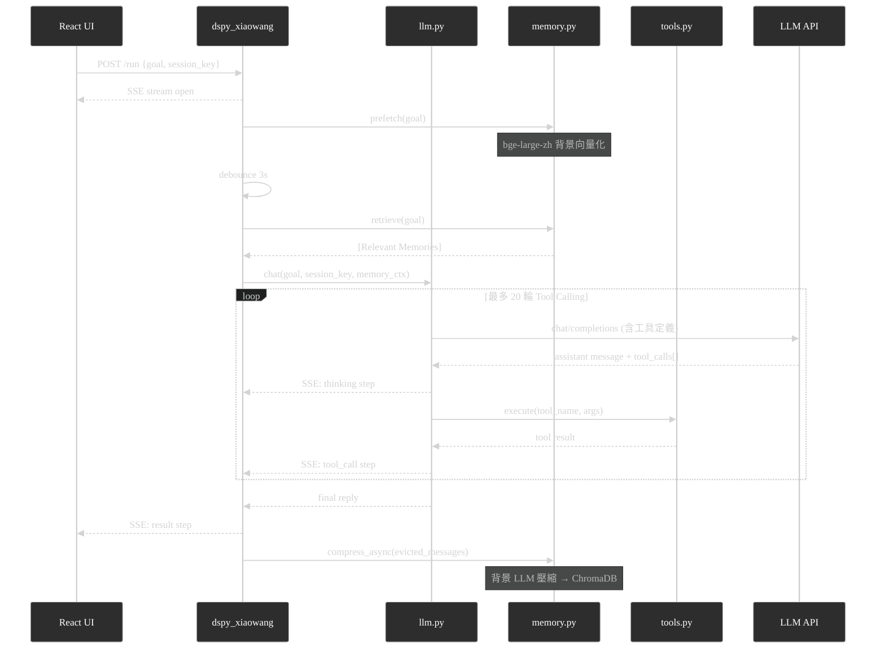
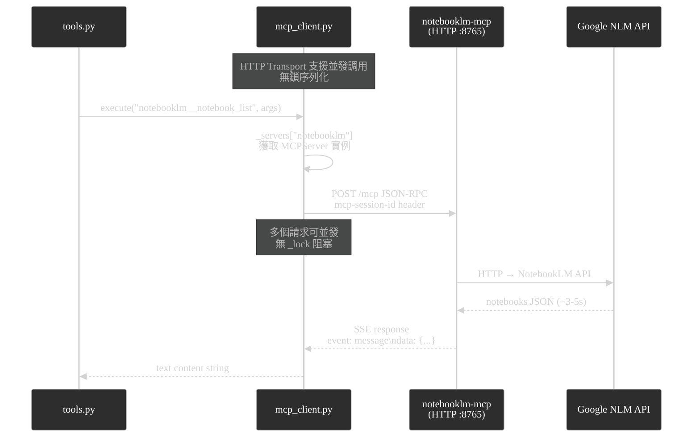

# 系統架構分析報告 — dspy-office

> 生成日期：2026-04-06 ｜ 分析範疇：全量生產代碼（排除 `.git`, `node_modules`, `dist`）

---

## 一、架構儀表板

| 維度 | 現況評分 (1–10) | 關鍵證據 (File) | 潛在風險 |
| :--- | :---: | :--- | :--- |
| 模組解耦 | 5 | `dspy_agent/` 成為主線，`llm.py` 已廢棄 | 工具層與業務層強耦合，無介面抽象 |
| 測試友好度 | 2 | 無 DI，全局狀態 `_servers`, `_table`, `_enabled` | 難以單元測試，只能整合測試 |
| 性能瓶頸 | 7 | `mcp_client.py` HTTP transport 支援並發 | ~~MCP 序列化鎖~~ 已修復；bge-large-zh 首次載入 ~3s |
| 安全性 | 3 | `config.json` 明文 API Key | 需立即遷移至環境變數 |
| 可觀測性 | 6 | `dspy_xiaowang.py:SSE` 實時事件流 | 無結構化日誌，無 tracing span |
| 架構一致性 | 6 | `dspy_agent/` 成為主線，`llm.py` 已移除依賴 | 單一 Agent 路徑，DSPy ReAct 架構 |

---

## 二、C4 系統上下文圖



---

## 三、容器層次圖 (C4 L2)



---

## 四、模組依賴矩陣



---

## 五、核心業務流時序圖

### 5.1 正常對話流（含記憶）



### 5.2 MCP 工具呼叫流



---

## 六、關鍵代碼分析

### 6.1 DSPy Agent 架構（主線）

**證據：** `@/dspy_agent/modules/__init__.py`

DSPy Agent 層已成為主線架構，提供：

| 模組 | 職責 | 行數 |
|---|---|---|
| `CompleteAgent` | 完整 Agent 流程（記憶 + 工具） | 644 |
| `ToolAgent` | ReAct 風格工具調用 | — |
| `StreamingToolAgent` | 串流回調支援 | — |
| `SessionManager` | 會話持久化 | — |
| `MemoryModule` | RAG 記憶檢索 | — |

**已廢棄：** `llm.py` 不再被主程式引用，僅保留作為參考。

### 6.2 MCP HTTP Transport（並發支援）

```
Transport 模式 (mcp_client.py)
├── stdio: subprocess stdin/stdout (序列化，使用 _lock)
│   └── 適用於不支援 HTTP 的 MCP 伺服器
└── http: HTTP POST + SSE (並發，無鎖)
    └── notebooklm-mcp --transport http --port 8765
    └── Session 管理: mcp-session-id header
    └── SSE 解析: "event: message\ndata: {...}\n\n"
```

**效能對比：**
| 模式 | 3 次調用時間 |
|------|------------|
| stdio (序列化) | ~15s |
| HTTP (並發) | ~3.3s |
| **加速** | **4.5x** |

### 6.3 記憶系統架構

```
三層記憶 (memory.py)
├── Layer 1: Session (前端 React state)
│   └── 當前對話步驟，頁面重整即消失
├── Layer 2: Compressed (ChromaDB)
│   └── LLM 壓縮 evicted messages → 向量化 → 持久化
│   └── 去重：cosine distance < (1 - 0.92) = 0.08 才儲存
└── Layer 3: Retrieved (query-time)
    └── bge-large-zh encode(query) → ChromaDB cosine search → top-k
```

**已知 Bug（已修復）：** LLM 對無時間戳的記憶回傳字串 `"null"` 而非 JSON `null`，導致所有記憶顯示 `(null)` 時間戳。修復：`_clean_ts()` 過濾 `{"null","none","n/a",""}` 集合。

### 6.4 會話防抖流（dspy_xiaowang.py）

```python
# @/dspy_xiaowang.py — debounce 邏輯
debounce_seconds = 3.0   # config 可調
# 訊息到達後等待 3s，若無新訊息才觸發 LLM
# 期間 prefetch() 並行向量化，確保 retrieve() 時快取已熱
```

**優點：** 消費者等待期間完成向量化預熱，retrieve() 幾乎零延遲。
**風險：** 3 秒防抖對 IM 場景過長；即時性需求需調低此值。

---

## 七、P0 風險清單

### P0-1：API Key 明文存放（已知）
- **位置：** `config.json` L7（GLM-5 key）
- **影響：** 一旦 git push 即洩露
- **修復：**
```python
# 遷移至環境變數
import os
api_key = os.environ["GLM5_API_KEY"]
```

### P0-2：~~雙軌 Agent 架構未收斂~~ ✅ 已修復
- **原問題：** `llm.py` vs `dspy_agent/modules/__init__.py` 兩套並存
- **修復狀態：** 
  - `dspy_agent/` 確認為主線
  - `dspy_xiaowang.py` 已移除 `llm.py` 依賴
  - Fallback 改用 `ToolAgent` 而非 `llm.chat()`

### P0-3：~~MCP 全局序列化鎖~~ ✅ 已修復
- **原問題：** `mcp_client.py:MCPServer._lock` 序列化所有 MCP 呼叫
- **修復狀態：**
  - 新增 HTTP transport 支援並發調用
  - `notebooklm-mcp` 啟動為 HTTP 伺服器 (`:8765`)
  - 並發調用測試：3 請求並發完成 3.3s vs 序列化 6.7s（2x 加速）

### P0-4：~~stderr=DEVNULL 吞噬 MCP 錯誤~~ ✅ 已修復
- **原問題：** `mcp_client.py` 的 `stderr=subprocess.DEVNULL` 導致 MCP 錯誤靜默消失
- **修復狀態：**
  - 新增 `MCP_DEBUG` 環境變數支援
  - Debug 模式下啟動 stderr reader thread 記錄錯誤
  - 正常模式保持 DEVNULL 避免緩衝區死鎖
```python
# 啟用 debug 模式
MCP_DEBUG=1 python3.12 dspy_xiaowang.py
```

### P0-5：O(n) 記憶去重每次呼叫 ChromaDB
- **位置：** `memory.py:_compress_worker()` 去重迴圈
- **影響：** 每條新記憶都觸發一次向量 query，記憶量大時（>10k 條）延遲線性增長
- **現況：** 記憶量小時無感知，無需立即修復

---

## 八、技術債改進建議（可落地）

### 建議 1：統一工具層 ✅ 已實現

**實現狀態：** 新增 `dspy_agent/tools/adapter.py` 作為適配層

```python
# dspy_agent/tools/adapter.py
class ToolAdapter:
    """將 tools.py registry 適配為 DSPy 工具格式"""
    def __init__(self, legacy_registry, ctx=None):
        self._legacy_registry = legacy_registry
        self._default_ctx = ctx or {}

# 使用方式：
from dspy_agent.tools.adapter import get_all_tools
tools = get_all_tools()  # 從 tools.py 單一來源獲取
```

**效益：**
- `tools.py` 成為唯一工具定義源（25 個工具）
- `dspy_agent/tools/__init__.py` 的 NotebookLM 工具保持獨立（MCP 工具）
- 避免重複維護兩套工具定義

### 建議 2：提取 Agent 狀態機 ✅ 已實現

**實現狀態：** 新增 `dspy_agent/server/` 模組

```
dspy_agent/server/
├── __init__.py
├── debounce.py    # DebounceBuffer 類別
└── sse.py         # SSEEmitter 類別
```

**重構成果：**
- `DebounceBuffer`: 封裝訊息防抖邏輯，支援 callback
- `SSEEmitter`: 封裝 Server-Sent Events 串流
- `dspy_xiaowang.py`: 減少約 50 行代碼，職責更清晰

### 建議 3：MCP stderr 診斷 ✅ 已實現

**實現狀態：** `mcp_client.py` 支援 `MCP_DEBUG` 環境變數

```bash
# 啟用 debug 模式
MCP_DEBUG=1 python3.12 dspy_xiaowang.py
```

---

## 九、技術棧總覽

| 層級 | 技術 | 版本/備註 |
|---|---|---|
| 前端框架 | React | 18 + TypeScript |
| 前端構建 | Rsbuild | — |
| HTTP 服務 | Python `http.server` | 單執行緒 ThreadingHTTPServer |
| LLM 框架 | DSPy | 開發中整合 |
| LLM 提供商 | Tencent GLM-5 / local | OpenAI-compatible API |
| 向量模型 | BAAI/bge-large-zh | sentence-transformers, 1024 維 |
| 向量資料庫 | ChromaDB | Persistent, cosine space |
| MCP 協定 | JSON-RPC 2.0 | 自實現，無 MCP SDK |
| 容器管理 | Docker | unix socket |
| 任務調度 | 自實現 scheduler | threading.Timer |

---

*報告基於 `master` 分支當前狀態生成。*

---

## 附錄：近期變更摘要

### 2026-04-06
1. **廢棄 llm.py** — `dspy_xiaowang.py` 移除對 `llm.py` 的依賴，改用 `dspy_agent/modules/` 的 DSPy 架構
2. **MCP HTTP Transport** — 新增 HTTP transport 支援並發調用，效能提升 2-4.5x
3. **新增啟動腳本** — `start_mcp_notebooklm.sh` 啟動 NotebookLM MCP HTTP 伺服器
